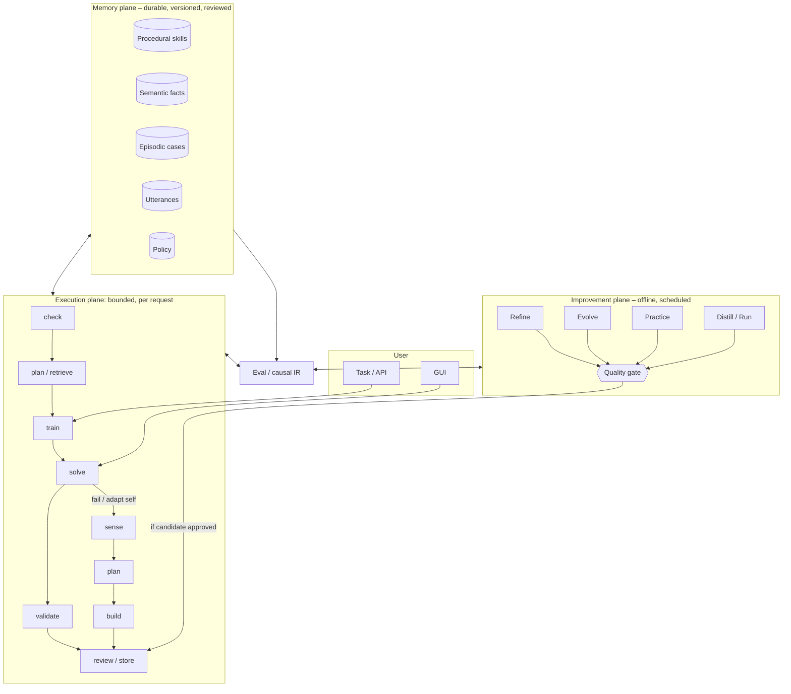
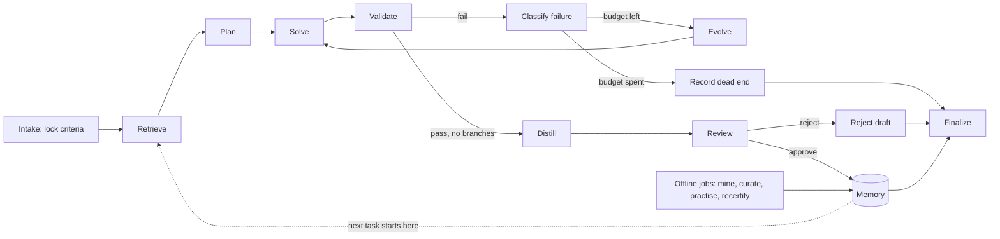

# Recertia

Recertia is a self-improving agent system: it solves tasks, distills what worked into reusable
memory, and gets faster and more reliable at similar tasks over time.

The execution model is a **graph with loops**. A task is one bounded cyclic walk over a small
set of nodes. Compounding happens *across* walks, through durable versioned memory that every
later run reads before inventing anything new — and through offline jobs that reorganise,
practise, and re-certify what has been learned.

## What it is

Recertia is built for recurring work — repository chores, research briefs, and similar
task classes — where past solutions should make the next attempt cheaper and more reliable.
Each run locks machine-checkable success criteria, retrieves relevant skills and cases before
solving, validates the result, and only then proposes durable memory. Nothing is learned by
silently mutating state: skills, facts, and cases are versioned, reviewable, and revertible.
Failures are stored as knowledge too, so the system can avoid dead ends it has already seen.

Improvement is representational, not parametric: there is no weight training. Competence grows
through a plural memory plane (procedural skills, semantic facts, episodic cases, utterances,
and policy) and an offline improvement plane that refines, evolves, practises, and recertifies
candidates behind a quality gate. A causal control arm with retrieval suppressed keeps “it got
better” as a measured claim rather than a hopeful one. The active skill library is bounded and
retires low-contribution entries so performance does not drift below a no-memory baseline.

**Primary input (Variant B):** a structured [`Goal`](contracts/goal.py) of desired outcomes and
constraints, compiled to locked `TaskCriterion[]` at intake. Natural language is optional
context. See [ADR-0010](docs/adr/0010-goal-as-primary-input.md) and
[Goal objects](docs/specifications/goal-objects.md).

## How it is used

Day to day you drive Recertia from the CLI or the HTTP API. Install the package, then submit a
task with `recertia run --goal goal.json` (preferred) or `recertia run --spec task.json`
(or `POST /v1/runs`). The graph walks intake → retrieve → plan → solve → validate, evolving
within budget on failure and distilling on success. Inspect progress with
`recertia runs show <run_id>`, resume interrupted work with `recertia resume`, and verify the
integrity ledger with `recertia ledger verify`.

Over time you manage the library: search and lint skills (`recertia skills search`,
`recertia skills lint`), promote golden-gated versions (`recertia skills promote`), and measure
lift against ablations (`recertia lift --task-class …`). API keys for the FastAPI surface are
issued with `recertia keys`. Seed skills live under `skills/`; golden evals under `evals/`;
normative contracts under `contracts/` (generated into `schema/`). Detail on planes, nodes,
and promotion lives in the documents below.

### Container sandbox (Docker / Podman)

Production solves run inside an OCI container (`RECERTIA_EXECUTION_BACKEND=container`, default).
Install Docker or Podman, pull `python:3.12-slim`, then smoke-test:

```bash
export RECERTIA_EXECUTION_BACKEND=container
python3 scripts/smoke_container.py
```

Without a runtime, use `recertia run --local-exec` for development only. Permissions, digest
pinning, and CI notes: [`docs/architecture/container-sandbox.md`](docs/architecture/container-sandbox.md).

## Documents

| Document | Contents |
| --- | --- |
| [`docs/architecture/`](docs/architecture/overview.md) | Three planes, memory taxonomy, node topology, composition, concurrency and merge discipline, library capacity, improvement jobs, measurement integrity, governance |
| [`docs/architecture/container-sandbox.md`](docs/architecture/container-sandbox.md) | Docker/Podman setup, bind-mount permissions, hardening, smoke test |
| [`docs/specifications/`](docs/specifications/core-entities.md) | Data model, graph state, node contracts, retrieval/validation/distillation specs, failure taxonomy, capacity and retirement, concurrency and merge contracts, HTTP/CLI surface, metrics |
| [`docs/specifications/goal-objects.md`](docs/specifications/goal-objects.md) | Goal as primary input (Variant B) |
| [`docs/implementation-plan.md`](docs/implementation-plan.md) | Milestones M0–M9, repo layout, test strategy, risks |
| [`docs/refactor-plan.md`](docs/refactor-plan.md) | Pre-M0 structural debt: contradictory contracts, milestone dependencies, schema ownership |
| [`docs/assumptions.md`](docs/assumptions.md) | Empirical claims tracked separately from engineering acceptance gates (B7) |
| [`docs/references.md`](docs/references.md) | Literature grounding, and the findings that contradicted an earlier draft |
| [`research/preprints-self-improving-agents.xlsx`](research/preprints-self-improving-agents.xlsx) ([JSON](research/preprints-self-improving-agents.scored.json)) | Scored survey of ~117 preprints against Recertia's non-negotiables |
| [`docs/score10-references/`](docs/score10-references/) | Bibliographies extracted from the four score-10 papers |

Decision records:

| ADR | Decision |
| --- | --- |
| [0001](docs/adr/0001-graph-with-loops.md) | Cyclic graph runtime with a thin in-house engine |
| [0002](docs/adr/0002-plural-memory.md) | Memory is plural: five planes, not one skill library |
| [0003](docs/adr/0003-criteria-preregistration.md) | Pre-registered criteria with sensitivity proofs |
| [0004](docs/adr/0004-offline-improvement-plane.md) | A separate offline improvement plane |
| [0005](docs/adr/0005-self-modification-boundary.md) | Tiered self-modification boundary |
| [0006](docs/adr/0006-bounded-library-and-retirement.md) | Bounded active library with contribution-score retirement |
| [0007](docs/adr/0007-skill-identity-status-and-stats-split.md) | Split `SkillVersion` (immutable) from `SkillStatus` (lifecycle) and `SkillStats` (derived) |
| [0008](docs/adr/0008-optional-join-and-failure-signals.md) | `join` is conditional on fan-out; failures are explicit signals, not inferred |
| [0009](docs/adr/0009-contracts-as-code.md) | Pydantic models in `contracts/` are the structural source of truth |
| [0010](docs/adr/0010-goal-as-primary-input.md) | Goal as primary task input; request is optional context |

Machine-readable contracts are generated from [`contracts/`](contracts) (Pydantic models,
ADR-0009) into [`schema/`](schema) (JSON Schema); see `scripts/generate_schemas.py` and
`scripts/export_examples.py`.

## Architecture

Three planes with different lifetimes. Keeping them separate is what stops "self-improving"
from meaning "one long process you have to trust". Detail lives in
[`docs/architecture/`](docs/architecture/overview.md).



- **Execution plane** — one bounded graph walk per request; fails into sense → plan → build; emits candidate memory, never learns in place.
- **Memory plane** — plural stores (skills, facts, cases, utterances, policy); diffable and revertible.
- **Improvement plane** — scheduled Refine / Evolve / Practice / Distill jobs; promotion always goes through the quality gate.

### The loop in one picture



`join` is not on this default path at all — it only exists when a run fan-out produces
branches to reduce (see [ADR-0008](docs/adr/0008-optional-join-and-failure-signals.md)). A
failed run's outcome (`record_dead_end`) and a rejected draft (`reject_draft`) are distinct
terminals from marking a *stored skill version* harmful, which is a memory-plane status
transition, never a step in this loop.

## Non-negotiables

Eight properties separate this from a chat log with extra steps:

1. **Retrieval before invention.** Solve never runs without first querying memory.
2. **Machine-checkable success.** Criteria are locked before solving and must prove they can fail.
3. **Versioned evolution.** Memory changes by producing a new version with lineage, never by
   silent mutation.
4. **Failure is knowledge.** Dead ends are stored, retrieved, and distilled into pitfall skills,
   so the system does not re-enter them.
5. **Causal measurement.** A sampled control arm runs with retrieval suppressed, so "it improved"
   is a measured claim rather than a hopeful one.
6. **A bounded library with a floor.** The active set is capped and skills retire on measured
   contribution, because unbounded growth has no performance floor — and because pruning too
   eagerly measured worse than keeping nothing.
7. **Bounded self-modification.** The system may not change the mechanisms that measure or
   constrain it.
8. **Nothing dispatched goes missing.** Every fan-in counts what it expected against what it
   received, and every model-scored check runs in a fresh context, so a run cannot finish early
   by losing a branch or by asking the solver whether it agrees with itself.

Everything else in these documents supports those eight.

## Status

Design intent is complete, structural blockers are resolved, and **M0–M9 plus operational
completion** are built:

- [`contracts/`](contracts) — normative structural source (ADR-0009), including Goal (ADR-0010)
- [`src/recertia/`](src/recertia) — full milestone stack plus container sandbox backends, store
  driver-swap, vector index API, FastAPI (`recertia.api`), content-addressed blobs, OTel JSONL
  export and dashboard JSON, skill/fact scope promotion, layered fan-in, practice curricula
- [`research/`](research) — scored preprint survey binaries (never normative)
- Enforced by tests and CI (`.github/workflows/ci.yml`)

Research outcomes remain tracked in [`docs/assumptions.md`](docs/assumptions.md).

## License

MIT — see [`LICENSE`](LICENSE).
