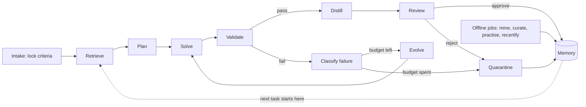

# Fandea

Fandea is a self-improving agent system: it solves tasks, distills what worked into reusable
memory, and gets faster and more reliable at similar tasks over time.

The execution model is a **graph with loops**. A task is one bounded cyclic walk over a small
set of nodes. Compounding happens *across* walks, through durable versioned memory that every
later run reads before inventing anything new — and through offline jobs that reorganise,
practise, and re-certify what has been learned.

## Documents

| Document | Contents |
| --- | --- |
| [`docs/architecture.md`](docs/architecture.md) | Three planes, memory taxonomy, node topology, composition, concurrency and merge discipline, library capacity, improvement jobs, measurement integrity, governance |
| [`docs/specifications.md`](docs/specifications.md) | Data model, graph state, node contracts, retrieval/validation/distillation specs, failure taxonomy, capacity and retirement, concurrency and merge contracts, HTTP/CLI surface, metrics |
| [`docs/implementation-plan.md`](docs/implementation-plan.md) | Milestones M0–M9, repo layout, test strategy, risks |
| [`docs/refactor-plan.md`](docs/refactor-plan.md) | Pre-M0 structural debt: contradictory contracts, milestone dependencies, schema ownership |
| [`docs/references.md`](docs/references.md) | Literature grounding, and the findings that contradicted an earlier draft |
| [`docs/preprints-self-improving-agents.xlsx`](docs/preprints-self-improving-agents.xlsx) | Scored survey of ~117 preprints against Fandea's non-negotiables |
| [`docs/score10-references/`](docs/score10-references/) | Bibliographies extracted from the four score-10 papers |

Decision records:

| ADR | Decision |
| --- | --- |
| [0001](docs/adr/0001-graph-with-loops.md) | Cyclic graph runtime with a thin in-house engine |
| [0002](docs/adr/0002-plural-memory.md) | Memory is plural: five planes, not one skill library |
| [0003](docs/adr/0003-criteria-preregistration.md) | Pre-registered criteria with sensitivity proofs |
| [0004](docs/adr/0004-offline-improvement-plane.md) | A separate offline improvement plane |
| [0005](docs/adr/0005-self-modification-boundary.md) | Tiered self-modification boundary |
| [0006](docs/adr/0006-bounded-library-and-retirement.md) | Bounded active library with contribution-score retirement |

Machine-readable contracts live in [`schema/`](schema).

## The loop in one picture

## Non-negotiables

Eight properties separate this from a chat log with extra steps:

1. **Retrieval before invention.** Solve never runs without first querying memory.
2. **Machine-checkable success.** Criteria are locked before solving and must prove they can fail.
3. **Versioned evolution.** Memory changes by producing a new version with lineage, never by
   silent mutation.
4. **Failure is knowledge.** Dead ends are stored, retrieved, and distilled into pitfall skills,
   so the system does not re-enter them.
5. **Causal measurement.** A sampled control arm runs with retrieval suppressed, so "it improved"
   is a measured claim rather than a hopeful one.
6. **A bounded library with a floor.** The active set is capped and skills retire on measured
   contribution, because unbounded growth has no performance floor — and because pruning too
   eagerly measured worse than keeping nothing.
7. **Bounded self-modification.** The system may not change the mechanisms that measure or
   constrain it.
8. **Nothing dispatched goes missing.** Every fan-in counts what it expected against what it
   received, and every model-scored check runs in a fresh context, so a run cannot finish early
   by losing a branch or by asking the solver whether it agrees with itself.

Everything else in these documents supports those eight.

## Status

Design intent is complete; several load-bearing contracts are not yet implementable as
written. [`docs/refactor-plan.md`](docs/refactor-plan.md) lists the blockers that must land
before M0; [`docs/implementation-plan.md`](docs/implementation-plan.md) is the build order
after that.

## License

MIT — see [`LICENSE`](LICENSE).
