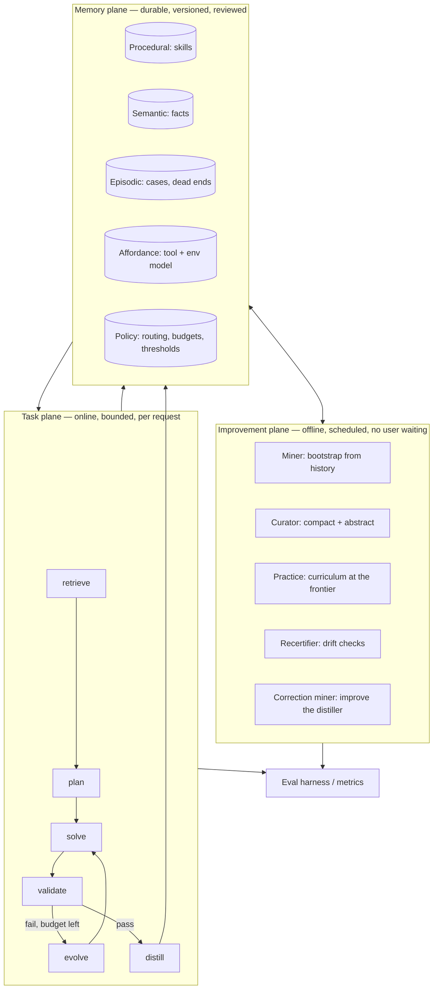
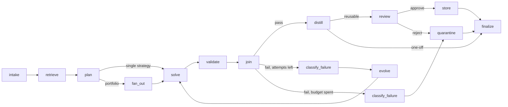
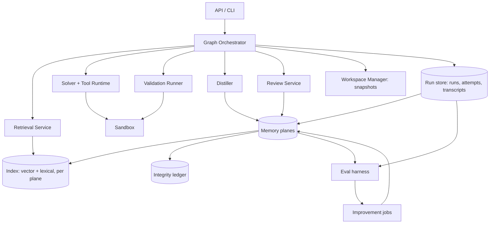
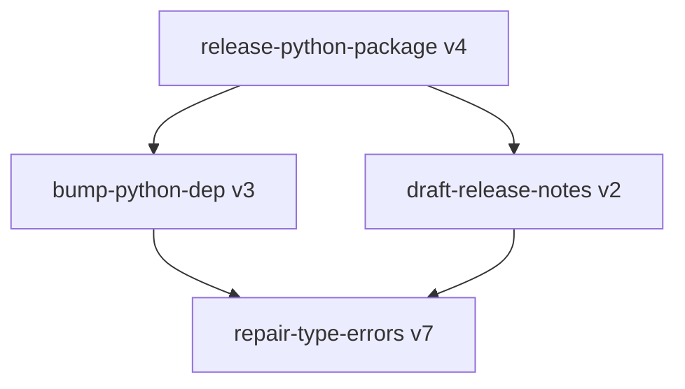
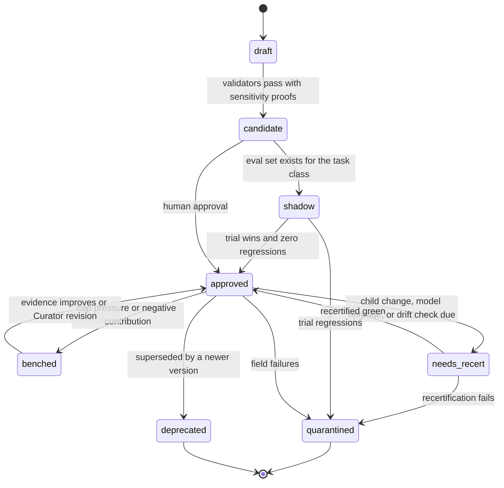

# Fandea Architecture

## 1. Purpose and scope

Fandea is a task-solving system whose competence increases with use. It does this by
treating *solved work* as durable, versioned, retrievable state, and by making retrieval a
mandatory step before any new problem-solving attempt.

This document describes the runtime shape. Data contracts are in
[`specifications.md`](specifications.md); build order is in
[`implementation-plan.md`](implementation-plan.md). Decisions with alternatives worth
recording live in [`adr/`](adr), and [`references.md`](references.md) lists the literature
this draws on — including the findings that contradicted an earlier draft and changed it.

### Design goals

- A task that resembles a previously solved task should be solved with fewer attempts,
  less model spend, and higher first-attempt success than the first time.
- Nothing enters durable memory that cannot be validated automatically.
- Every stored artifact is attributable to the run that produced it, and revertible.
- The system degrades to "a competent agent with no memory" when memory is empty, and
  never degrades *below* that because of a bad retrieval.
- Improvement claims are falsifiable: the system measures its own lift against a control,
  not against its own optimism.
- The library has a **performance floor**: a bounded active set plus outcome-driven retirement
  keep expected performance from drifting below the no-memory baseline as the library grows
  (§7.2). Growth without this property is a known failure mode, not a theoretical worry — see
  [`references.md`](references.md) §1.1.

### Explicit non-goals

- No model weight training or fine-tuning. Improvement is representational — memory,
  retrieval, validators, policy — not parametric.
- No unbounded autonomy. Loops are budgeted, promotion is gated, and the system may not
  modify its own safety controls (§14).
- No cross-tenant learning in v1. Memory is scoped to a single owner (§15.4).

## 2. Why a graph with loops

A linear pipeline cannot express the two things this system does most: retrying with new
information, and revising an artifact until it passes a gate. Both are cycles.

A cyclic graph gives each concern exactly one home:

| Concern | Graph construct |
| --- | --- |
| "Have we seen this before?" | A `retrieve` node that always precedes `solve` |
| "Did it actually work?" | A conditional edge out of `validate` |
| "Try again, differently" | A back-edge `evolve → solve` with mutated state |
| "Try several ways at once" | Fan-out to parallel branches, join on validator score (§5.3) |
| "A human must agree" | A `review` node that blocks the write to storage |
| "Don't spin forever" | Budget checks on every back-edge |
| "Get better over time" | Durable stores read by `retrieve` on the *next* walk |

Encoding retries as nested calls inside a solver instead would hide the control flow, make
budgets ad hoc, and make it impossible to checkpoint or audit a partially completed task.
The graph makes iteration explicit, inspectable, and resumable. See
[ADR-0001](adr/0001-graph-with-loops.md).

## 3. Three planes

The system splits into three planes with different lifetimes. Keeping them separate is
what stops "self-improving" from meaning "one long process you have to trust".

**Task plane** is one bounded walk per request: retrieve, decide, attempt, check, revise.
It never learns in place; it emits candidate memory writes.

**Memory plane** is the learned state. It is just data — diffable, reviewable, revertible.

**Improvement plane** is the part my first pass under-specified, and it matters: a system
that only learns while a user waits can never reorganise what it knows, practise what it is
bad at, or notice that a skill has rotted. These are scheduled jobs, not a daemon with
opinions (§8).

### Loop levels

- **Inner loop (bounded, in-process):** attempt → check → revise within one run (§10).
- **Outer loop (durable, across runs):** memory written by one run is read by the next.
- **Meta loop (offline, governed):** the improvement plane changes *how* the system learns
   — distiller prompts, retrieval thresholds, routing policy — inside a hard boundary on
   what may change without a human (§14).

## 4. Memory is plural

My first pass had a single store — skills — which meant anything that is not a procedure
had to be rediscovered on every run, and every failure was thrown away. Five stores, each
with a distinct write path and read path. See [ADR-0002](adr/0002-plural-memory.md).

| Plane | Holds | Written by | Read by | Why it is not a skill |
| --- | --- | --- | --- | --- |
| **Procedural** | Skills: parameterised, validated procedures | `distill` → `review` → `store` | `retrieve` | — |
| **Semantic** | Durable facts and invariants: "migrations run through `scripts/migrate`", "package X is pinned for reason Y" | `distill` (fact extraction), Miner, humans | `retrieve`, `plan`, `solve` | A fact has no steps and no exit code; it constrains *how* a procedure runs |
| **Episodic** | Cases: transcripts of solved and failed attempts, including **dead ends** with the reason they failed | every run, automatically | `retrieve` (analogy), `evolve` (avoid repeats), Practice | Most cases never generalise into a skill; they are still the best evidence for a novel task |
| **Affordance** | Learned model of tools and environment: error signatures, flake rates, latency and cost, version quirks | tool runtime telemetry, `validate` | `plan`, `solve`, `evolve`, Recertifier | It describes the world, not the work; it changes without any task occurring |
| **Policy** | Meta-parameters: model tier per task class, budget defaults, retrieval thresholds, escalation ladder | Correction miner, eval harness, humans | `intake`, `plan`, `retrieve` | It governs the system's own behaviour and is therefore governed (§14) |

Two consequences worth stating plainly.

**Negative knowledge is first-class.** A failed attempt records *what was tried and why it
failed* into the episodic store, and `evolve` and `retrieve` both read it. The original
design routed failures to quarantine and discarded them, which threw away roughly half of
all available signal — a system that cannot remember dead ends will re-enter them.

**Retrieval is federated.** `retrieve` queries all readable planes and returns a typed
bundle: candidate skills, relevant facts, analogous cases, known dead ends, and tool
cautions. Each element carries its own trust and provenance, and each is subject to the
score floor and precondition filtering in §5.5.

## 5. Task plane

### 5.1 Node topology

| Node | Responsibility | Must not do |
| --- | --- | --- |
| `intake` | Normalise the request into a `Task`; resolve budgets and model tier from the policy store; record the run manifest (§11.3); **lock pre-registered success criteria** (§11.1) | Call a solver model |
| `retrieve` | Federated query across memory planes; evaluate preconditions; apply score floor; honour ablation suppression (§11.4) | Execute anything |
| `plan` | Choose `apply` / `adapt` / `scratch` / `portfolio` / `abstain`; emit a calibrated `predicted_success`; record the reason | Mutate memory |
| `fan_out` | Split budget across ≤3 branches with distinct strategies | Exceed the parent budget |
| `solve` | Execute tools and models to produce artifacts plus a structured transcript, inside an isolated attempt workspace (§10.2) | Judge its own success |
| `validate` | Execute locked criteria in a sandbox; emit a per-criterion result vector | Rewrite or relax criteria |
| `join` | Select the winning branch by validator result, then cost; discard losers to episodic memory | Prefer a branch on model preference alone |
| `classify_failure` | Assign a failure class from the taxonomy (§12) with evidence | Retry |
| `evolve` | Choose the repair move dictated by the failure class; decrement a budget; restore the workspace to a clean snapshot | Loop without a class or a budget decrement |
| `distill` | Extract skill draft **and** facts and affordance updates; apply the reusability filter | Store directly |
| `review` | Apply promotion policy; request a human when policy requires | Block the caller's answer |
| `store` | Idempotent, transactional write of new versions with lineage; append to the integrity ledger | Overwrite an existing version |
| `quarantine` | Record the failure and dead ends; mark implicated versions suspect | Delete history |

`finalize` returns the caller's answer. It does not wait on review: a run can succeed while
its distilled skill sits pending.

`abstain` deserves emphasis as a legitimate plan outcome. A system that always acts cannot
improve its judgment about when not to; abstention with a stated reason is recorded, scored
for calibration, and is often the correct behaviour on a novel destructive task.

### 5.2 Component architecture

### 5.3 Graph Orchestrator

Owns state transitions, routing, budget accounting, checkpointing, and now fan-out/join.
Checkpoints after every node, so runs are resumable at node granularity. Deterministic given
`(state, node outputs)`, which is what makes replay testing possible.

**Fan-out exists because validators make parallel exploration cheap to adjudicate.** When
several plausible strategies exist — apply skill A, adapt skill B, solve from scratch —
running them concurrently and letting the criteria pick the winner converts model
uncertainty into compute spend, which is the trade you want when a validator is trustworthy.
It also gives shadow trials (§7) and ablation arms (§11.4) the same machinery.

Two kinds of fan-out, with different join semantics:

| Kind | Branches are | Join rule | Use when |
| --- | --- | --- | --- |
| **Portfolio** | Competing strategies for the *same* task | One winner by criteria, then cost | The right approach is uncertain |
| **Decomposition** | Disjoint *parts* of the work | All must complete, then synthesise | The work is wide and parts are independent |

Decomposition is the "diamond" — fan out, reduce, synthesise — and it was missing from the
first draft, which could only race strategies against each other, never split work
([`references.md`](references.md) §1.7). The test for whether a split is legitimate is the
**fake-edge test**: a dependency is real only if the later step consumes what the earlier one
produced. Steps ordered merely because someone wrote them in that order are sequential for no
reason, and that ordering is usually where latency hides (§6.1).

Constraints on both kinds: branches get disjoint workspaces **and** non-overlapping write
claims on shared resources (§5.6), the parent budget is divided rather than multiplied, `join`
breaks ties by cost rather than model preference, and every join audits input completeness
(§5.10).

### 5.4 Memory stores

Canonical representation per plane:

- **Procedural:** one JSON document per version at `skills/<slug>/v<N>.json`, in git.
  Promotion is a pull request; rollback is a revert.
- **Semantic:** `facts/<scope>/<slug>.json`, in git, each with provenance and an optional
  verification check.
- **Episodic:** content-addressed transcript blobs plus a case index row. Not in git — high
  volume, write-once.
- **Affordance:** derived telemetry aggregates, rebuildable from the run store.
- **Policy:** a versioned config document in git, changeable only under §14 rules.

Everything queryable is rebuildable from the canonical form. That rule is what lets the
index be treated as a cache rather than as a second source of truth.

### 5.5 Retrieval Service

Hybrid by necessity: lexical matching catches exact tool and entity names, vector similarity
catches paraphrase. Merge with reciprocal rank fusion, filter by declared preconditions,
rerank, then apply a score floor. Returns a typed bundle across planes (§4).

Retrieval remains the highest-leverage failure surface — a confidently wrong skill is worse
than empty memory because it anchors the solver. Controls: preconditions **drop** candidates
rather than down-ranking them, a score floor discards weak matches, `plan` may reject
everything, and an empty bundle is a healthy outcome. Retrieval is reproducible because the
index snapshot id is recorded in the run manifest.

Only the **active set** is retrievable (§7.2). This matters more than it sounds: flat retrieval
is reported to degrade in the moderate regime of tens to hundreds of skills
([`references.md`](references.md) §1.5), so an unbounded retrievable library is a decay mechanism
rather than a growing asset. Skills below the evidence floor are score-demoted rather than
dropped, since premature exclusion measured *worse* than having no library at all
([`references.md`](references.md) §1.2).

### 5.6 Solver and Tool Runtime

Model-driven execution against a registered tool set. Every call and result is appended to a
structured transcript — the transcript is the raw material for distillation, so it is a
product, not a log. Tools declare a side-effect class (`read`, `write`, `external`) and
required approvals; anything beyond `read` runs sandboxed and, when policy demands, waits for
approval. Tool telemetry (durations, exit signatures, retries) feeds the affordance plane.

**Resource claims make hidden edges visible.** Two steps can look independent because neither
mentions the other while both write the same file, hold the same lock, or exhaust the same
rate-limited API. Workspace isolation does not help, because the collision is outside the
workspace. Steps and tools therefore declare claims — `file`, `path`, `service`, `rate_limit`,
`lock`, `external_system` — in `read`, `write`, or `exclusive` mode, and overlapping non-read
claims are treated as a dependency edge that forbids concurrency
([`references.md`](references.md) §1.7).

### 5.7 Validation Runner

Executes locked `success_criteria` as real, isolated checks with per-criterion pass/fail and
captured output. Kinds: `command`, `assertion`, `schema`, `metric`, `judge`. A `judge`
criterion is never sufficient alone — promotion requires at least one non-`judge` criterion —
and every criterion must carry a **sensitivity proof** (§11.2).

**Model-scored criteria run in a fresh context.** A judge that inherits the solver's transcript
is not checking the work, it is agreeing with the reasoning that produced it — the same
self-agreement failure that makes a model a poor grader of its own output, just wearing a second
name. Judges therefore receive the artifact and the rubric and nothing else.

**Judges triangulate rather than repeat.** When several model-scored criteria apply, they must
ask different questions — `correctness`, `currency`, `provenance`, `scope`, `safety` — because
a few different lenses catch what many identical ones miss
([`references.md`](references.md) §1.7).

### 5.8 Distiller

Two authoring paths, because skills learned from success and skills learned from failure carry
different information:

- **Success path.** A winning transcript becomes a skill draft, extracted facts, and affordance
  updates. Literals generalise into parameters, incidental steps are pruned, criteria are
  proposed.
- **Failure-cluster path.** Recurring failures in the episodic plane — the same dead end reached
  by three or more runs in a task class — become pitfall-oriented skills whose substance is
  `failure_modes` and preconditions rather than a happy-path sequence. This path exists because
  the systems that measured real gains synthesise from failure clusters, and because constraining
  guardrails outperformed aspirational guidance ([`references.md`](references.md) §1.4).

Both paths run under an **authoring prior**: versioned guidance fixing skill shape, granularity,
and naming. This is a T2 surface (§14) and the single highest-value component in the one ablation
study that measured its removal, costing 43% of the total gain
([`references.md`](references.md) §1.3). It also implicitly
suppresses near-duplicates, which is why deduplication is a secondary Curator mechanism here
rather than a primary one.

The **reusability filter** keeps the library from filling with one-offs. All checks must pass:
parameterisable, context-free, checkable, not a near-duplicate, and bounded. A `one_off` verdict
is recorded against the task class rather than discarded; three accumulated one-offs in a class is
the strongest available signal that a skill is missing, and the Practice job (§8.3) consumes
exactly that signal.

### 5.9 Review Service

Implements the promotion lifecycle and the human gate (§7), plus trust and calibration
bookkeeping.

### 5.10 Merge discipline

Fan-in is where graphs fail differently from chains, and worse. In a chain a dead step halts
everything, which is annoying but obvious. In a graph, one dead branch among many can vanish into
a synthesis that looks complete ([`references.md`](references.md) §1.7). Two rules:

**Count inputs at every merge.** Each fan-in records expected against received and either flags
or fails on a gap. Proceeding silently on partial data is forbidden, because the output is
indistinguishable from a full result.

**Layer the fan-in.** Feeding many raw branch outputs into one synthesis step exhausts context
before synthesis begins. Merges batch, summarise each batch, then combine summaries — never the
raw pile. Reduction steps prefer plain code over a model wherever the combination is mechanical,
since deterministic reduction is cheaper and cannot hallucinate a merge.

## 6. Skill algebra: composition and hierarchy

### 6.1 Steps are a graph, not a list

A skill's steps declare `depends_on`, so the steps of one skill form a DAG rather than a
sequence. Independent steps run concurrently; only real dependencies serialise.

This exists because an ordered list encodes a dependency between every adjacent pair, most of
which do not exist. "Review file A, then review file B" reads as a sequence but the second step
never consumes the first's output, so the ordering buys nothing and costs the sum of both
runtimes instead of the larger one. The **fake-edge test** — does this step actually consume what
the previous one produced? — is the rule for authoring and for Curator review alike
([`references.md`](references.md) §1.7).

Constraints: the step graph is acyclic and validated at store time; `depends_on` ids must exist;
concurrency additionally respects resource claims (§5.6), so two steps with overlapping write
claims serialise even when neither depends on the other's output; and a merge step reading many
predecessors follows the merge discipline in §5.10.

The authoring prior (§5.8) instructs the distiller to declare only edges that carry data, which
makes parallelism the default outcome of honest authoring rather than a later optimisation.

### 6.2 Skills compose

Flat skills scale badly. Coverage grows combinatorially with task variation while a flat
library grows linearly with tasks solved, so a flat design forces either an enormous library
or narrow coverage. Skills therefore compose: a skill may declare `uses: [{skill_id,
version}]` and invoke a pinned child version as a step.

Rules that make composition safe rather than a new failure mode:

- **Pinned children.** A parent references an exact child version, so a child's evolution
  cannot silently change a parent's behaviour.
- **Acyclic.** The `uses` graph is a DAG; cycles are rejected at store time.
- **Transitive invalidation.** Quarantining or deprecating a child marks every parent that
  pins it as `needs_recert`. Parents re-validate against their golden set before returning to
  `approved`.
- **Depth bound.** Composition depth ≤ 3 in v1, since deeper chains make attribution and
  budget accounting unreliable.
- **Abstraction is the Curator's job.** When several skills share a step sequence, the
  Curator proposes extracting a child skill and rewriting the parents as a reviewable change
  (§8.2). Abstraction is how the library gets *smaller* while coverage grows — the only
  mechanism here that fights entropy.

## 7. Promotion, trust, and library capacity

### 7.1 Lifecycle and earned autonomy

`shadow` is where autonomy is earned: a candidate is retrieved and planned, the approved
version's result is what ships, and the two are compared offline. Enough shadow wins let
policy promote without a human — the human gate relaxes on evidence rather than being absent
from the start.

**Curation provenance affects the bar.** Skills carry `curation`: `human_authored`,
`mined_from_human_artifact`, or `self_distilled`. The one benchmark that separated these found
human-curated skills worth +16.2pp against a no-skill baseline while self-generated skills
delivered +0.0pp ([`references.md`](references.md) §1.1), so self-distilled skills require more
evidence to reach `approved`. This is a calibration of trust to measured reliability, not a
philosophical position about machine authorship.

Trust is a smoothed success ratio, so one lucky application cannot mint a high-trust skill. But a
ratio is not causal evidence, which is why trust is reported alongside a **causal lift estimate**
from the ablation arm (§11.4). A skill applied to easy tasks will show high trust and zero lift;
only the second number distinguishes a useful skill from a lucky one.

### 7.2 Bounded active set and retirement

The library is capped, and skills are retired on measured contribution. See
[ADR-0006](adr/0006-bounded-library-and-retirement.md).

| Mechanism | Rule | Default |
| --- | --- | --- |
| **Active cap** | Only `active` skills are retrievable; skills compete for slots per task class | 50 |
| **Contribution** | `ĉ(s) =` mean success with the skill applied, minus the control-arm baseline for that task class | — |
| **Evidence floor** | No retirement decision before this many applications | 30 |
| **Retirement threshold** | Bench when `ĉ(s) ≤ −τ` and the evidence floor is met | `τ = 0.10` |
| **Low evidence** | Score-demote in ranking; never drop | — |

Three properties this buys, each answering a specific failure:

**A performance floor.** With a finite cap and threshold, expected performance cannot drift more
than a bounded margin below the no-memory baseline. With an unbounded library and no retirement
rule, that bound does not exist at all — which is the configuration the earlier draft had.

**Retirement that measures the right thing.** Contribution is lift over solving *without* the
skill, not a raw success ratio. The control arm (§11.4) supplies the baseline, so the measurement
machinery already in the design does double duty here.

**Protection against over-pruning.** Aggressive retirement is not a conservative choice: in the
one ablation that tested it, harsh settings performed *below* the no-skill floor
([`references.md`](references.md) §1.2). Hence the evidence floor, a deliberately loose threshold,
and reversible benching rather than deletion. An earlier draft of this design cut skills at a 0.4
trust ratio after three applications, which is precisely the harmful setting.

Benching is reversible and lossless: history is retained, and a benched skill returns to `active`
when evidence improves or the Curator revises it. Because a cap means good skills can be benched
by competition rather than by poor performance, `active_cap_pressure` is tracked so a chronically
saturated cap is visible instead of silently discarding value.

## 8. Improvement plane

Five scheduled jobs. Each proposes changes through the same review and promotion path as any
run — no job writes `approved` state directly. See
[ADR-0004](adr/0004-offline-improvement-plane.md).

### 8.1 Miner — cold-start bootstrap

An empty library means every early user pays full price and the system looks worse than a
plain agent exactly when first impressions form. The Miner attacks that by distilling
candidate skills and facts from artefacts that already exist: git history, merged pull
requests, CI configuration, runbooks, and docs. Mined candidates enter as `draft` and must
pass validation like anything else — but they arrive with real evidence attached, because a
merged PR is a solved task with a review already on it.

This job is more than a convenience. Mined skills are `mined_from_human_artifact`, and the
measured gap between human-curated and self-generated skills
([`references.md`](references.md) §1.1) makes human-authored history the single most promising
source of early library quality. If that gap replicates in our domain, the Miner is the primary
mechanism and self-distillation is the supplement — the reverse of the original assumption.

### 8.2 Curator — capacity and entropy control

Retrieval precision decays as a library grows, and the surveyed literature puts that decay in the
moderate regime of tens to hundreds of skills, with lifecycle management "largely neglected" as
the field-wide bottleneck ([`references.md`](references.md) §1.1, §1.5). Curation is therefore the
load-bearing subsystem, not housekeeping.

The Curator proposes, in rough order of measured value: **retiring** skills with negative
contribution past the evidence floor (§7.2), **extracting** shared sub-procedures into child
skills (§6), **splitting** overloaded skills whose criteria fail in uncorrelated clusters,
**tightening** preconditions that produced wrong retrievals, **merging** near-duplicates, and
**compacting** version chains. Every proposal is a diff, gated by the golden-set regression run.

Deduplication sits late in that list deliberately: with a consistent authoring prior in place,
explicit deduplication was found to be largely subsumed by the prior itself
([`references.md`](references.md) §1.2), so it earns effort only after retirement and abstraction
are working.

### 8.3 Practice — curriculum at the frontier

Waiting for user tasks means learning only what traffic happens to cover. Practice generates
tasks aimed at the frontier of competence: task classes with high failure rates, classes with
≥3 recorded one-offs, skills with stale certification, and near-miss variations of tasks that
just barely passed. Selection targets the band where success probability is neither near 1
nor near 0, because that is where an attempt carries information. Practice runs are marked as
such, are budgeted separately, and their results never count toward user-facing metrics.

### 8.4 Recertifier — drift defence

Skills rot without anyone touching them: tools upgrade, APIs change, the model version
changes underneath. The Recertifier re-runs skills against their golden fixtures on a
schedule and on triggers — model upgrade, tool version change, child invalidation — and moves
failures to `needs_recert` or `quarantined` (§13).

### 8.5 Correction miner — improving the learner

When a reviewer edits a draft before approving, the diff is the single highest-quality signal
the system receives: a human demonstrating what a good skill looks like. The original design
stored the decision and discarded the edit. The Correction miner clusters these diffs into
recurring correction patterns and proposes updates to distiller guidance and criteria
templates. This is where the system improves *how it learns*, not just what it knows — and it
is bounded by §14.

## 9. Storage choices

| Concern | v1 | Upgrade path | Why |
| --- | --- | --- | --- |
| Skills, facts, policy | JSON in git | Same, plus signed tags | Diffable, reviewable, revertible |
| Metadata, cases, trust | SQLite | Postgres | Zero-ops start, identical SQL surface |
| Vector index (per plane) | `sqlite-vec` | `pgvector` | Co-located with metadata |
| Lexical index | SQLite FTS5 | Postgres `tsvector` | Same |
| Transcripts, snapshots | Content-addressed blobs on disk | Object storage | Large, write-once, dedupable |
| Checkpoints | SQLite rows | Postgres | Must survive process death |
| Integrity ledger | Append-only hash-chained table | Same, externally anchored | Tamper-evident provenance (§15.1) |

The v1 column lets one developer run everything locally with no services; the upgrade path is
a driver swap rather than a data model change.

## 10. Bounded loops and attempt isolation

### 10.1 Budgets

| Budget | Enforced at | Default |
| --- | --- | --- |
| `max_attempts` | `evolve → solve` | 4 |
| `max_tool_calls` | tool runtime | 200 |
| `max_tokens` | solver | task class default |
| `max_wall_clock_s` | orchestrator, per node | 900 |
| `max_cost_usd` | solver + tool runtime | task class default |
| `max_branches` | `fan_out` | 3 |
| `max_versions_written` | `store` | 2 |

Exhausting any budget routes to `classify_failure` then `quarantine`, never to another
`solve`. No-progress detection short-circuits when two consecutive attempts produce an
identical result vector: the same failure twice means the current strategy is exhausted, not
unlucky.

Budgets are also *allocated*, not just capped. The policy plane holds an escalation ladder —
start on a cheap model tier, escalate on specific failure classes — because spending
frontier-model budget on a task that a cheap tier solves is the most common way cost per
solved task fails to improve even as success rates do.

### 10.2 Attempt isolation and compensation

`solve` mutates a workspace, so retrying naively means attempt 2 starts from attempt 1's
mess — a bug that produces uninterpretable failures and poisons distillation. Therefore:

- Each attempt runs against a workspace snapshot taken before it starts.
- `evolve` restores the snapshot before routing back to `solve`, so every attempt starts
  from a known state, and the diff between attempts is attributable.
- Fan-out branches get disjoint workspace clones.
- Irreversible external side effects (`external` tools) are gated by approval and recorded
  with a compensating action where one exists; a skill whose steps include an uncompensable
  external effect cannot run in `portfolio` or `shadow` mode.

## 11. Measurement integrity

The failure mode that kills self-improving systems is not incompetence, it is self-deception:
the system optimises its own scorecard. Four structural defences, plus
[ADR-0003](adr/0003-criteria-preregistration.md).

### 11.1 Pre-registered criteria

Criteria are locked at `intake`, **before** `solve` runs, and their hash is recorded in the
manifest. A solver cannot tailor the target it is measured against, and a distiller cannot
retrofit criteria that its own transcript happens to satisfy. Criteria may be *added* during
a run only as advisory (`weight < 1.0`); required criteria are immutable once locked.

Where the caller supplies no criteria, a **critic** pass proposes them from the task intent
before solving, in a separate context from the solver. Same reason: independence.

### 11.2 Criterion sensitivity proofs

A criterion that never fails is decoration, and a suite of them makes everything look solved.
Every criterion must demonstrate that it **rejects** a known-bad artifact — the pre-solve
workspace, a mutated artifact, or a recorded prior failure — before it counts toward
promotion. This is mutation testing applied to validators. Criteria without a sensitivity
proof are advisory only.

### 11.3 Eval firewall and run manifest

Golden tasks must never be distilled from, or evals measure memorisation instead of
generalisation. Runs on eval fixtures are flagged and blocked at `distill`. Every run records
a manifest — model and version, tool versions, index snapshot, library commit, criteria hash,
seed — so any measurement is tied to an exact system state and can be replayed.

### 11.4 Ablation arm

Golden sets prove capability under lab conditions; they cannot prove that retrieval helps in
production, because retrieved-skill runs and scratch runs face different task mixes. So a
small sampled fraction of production runs (default 5%, task-class stratified, never on
destructive tasks) runs with retrieval suppressed as a control. That control is what turns
"first-attempt success went up" into "retrieval caused it", and it is the only defence
against the most comfortable failure mode: a library that grows, metrics that drift upward
for unrelated reasons, and nobody able to tell the difference.

The control arm also supplies the per-task-class baseline `p0` that per-skill contribution is
measured against (§7.2), so the same sampling serves both measurement and retirement.

## 12. Failure taxonomy

Blind retry is a waste of budget. `classify_failure` assigns a class, and the class dictates
`evolve`'s move:

| Class | Signal | `evolve` move |
| --- | --- | --- |
| `environment` | Setup or dependency failure before real work | Repair environment, do not touch strategy; does not count against skill trust |
| `tool` | Tool error or known flake in the affordance plane | Retry with backoff or substitute tool |
| `retrieval` | Applied skill's preconditions held but it was inapplicable | Drop candidate, re-retrieve, tighten the skill's preconditions |
| `plan` | Strategy was wrong in kind | Switch strategy, escalate model tier |
| `execution` | Right plan, wrong edit | Patch artifacts using criteria output |
| `criteria` | Criteria contradictory or unsatisfiable as written | Halt and escalate to human; never relax criteria |
| `budget` | Ran out of room | Terminate, report the frontier reached |

Two consequences matter. Environment and tool failures must not damage a skill's trust score
— otherwise flaky infrastructure silently quarantines good skills. And `criteria` failures
escalate to a human rather than being repaired by the system, since self-repair of the
scorecard is precisely what §11 exists to prevent.

## 13. Drift and non-stationarity

Nothing here is stationary: models are upgraded, tools change, repos evolve. Controls:

- **Environment fingerprint** in preconditions and certification, so a skill is not applied
  in an environment it was never validated in.
- **Model-version gate:** a skill's certification records the model it was validated on; a
  model upgrade marks affected skills `needs_recert` rather than trusting them silently.
- **Scheduled recertification** (§8.4) with staleness surfaced in retrieval ranking.
- **Trust decay:** trust weight decays with time since last successful application, so an
  old unverified skill does not outrank a fresh one on reputation alone.

## 14. Meta-learning and the self-modification boundary

The system improves its own machinery, which is exactly where a self-improving system can
become unsafe or unmeasurable. So capability is tiered explicitly
([ADR-0005](adr/0005-self-modification-boundary.md)):

| Tier | Scope | Change mechanism |
| --- | --- | --- |
| **T0 — autonomous** | Trust scores, affordance aggregates, episodic cases, retrieval caches | Written by runs; derived, revertible, no gate |
| **T1 — policy-gated** | New skill versions, facts, curator proposals, shadow promotions | Automatic promotion only with eval evidence and zero regressions |
| **T2 — human-gated** | Authoring prior and distiller guidance, criteria templates, retrieval thresholds, routing and escalation ladder, budget defaults, values of `active_cap` / `retirement_threshold` / `evidence_floor` | Versioned config; change requires human approval plus an eval comparison |
| **T3 — never autonomous** | Tool registry and side-effect classes, sandbox policy, promotion thresholds, the ablation rate, the graph topology, the *finiteness* of the active cap and retirement threshold, this boundary | Human-authored code or config review only |

The rule behind the table: **the system may not modify the mechanisms that measure or
constrain it.** A system that can lower its own promotion bar, shrink its own control arm, or
grant its own tool permissions has no trustworthy metrics and no meaningful containment —
and it would get there by optimising honestly for the objective it was given.

T2 changes are also improvements and must be evidenced the same way: propose, run the golden
sets against both configs, show lift, then a human approves.

## 15. Safety, integrity, failure model

### 15.1 Provenance integrity

Every memory write appends to a hash-chained ledger: actor, run, artifact hash, previous
head. Because the system writes its own memory, "who wrote this and on what evidence" must be
tamper-evident rather than merely logged, and a corrupted or poisoned history must be
detectable after the fact.

### 15.2 Memory as data, never instructions

Retrieved content is partly model-authored and partly derived from untrusted tool output, so
treating it as instruction is a prompt-injection channel straight into durable state. Skills
carry structured steps with tool references, not free-form imperative prose. Retrieved facts
and cases enter the solver context labelled as untrusted evidence. Tool arguments come from
bound parameters validated against the schema, never from concatenated memory text.

### 15.3 Secret and PII hygiene at write time

Distillation generalises from a real transcript, which may contain credentials, tokens, or
personal data. Store-time scanning and scrubbing is mandatory, and a draft failing the scan
is rejected rather than sanitised silently — memory is long-lived, and a leak into it is
worse than a leak in a log.

### 15.4 Scope and promotion across scopes

Facts and skills carry a scope: `run` → `project` → `org` → `global`. Cross-scope promotion
requires review and redaction, which keeps context learned in one project from silently
applying — or leaking — into another.

### 15.5 Risk table

| Risk | Control |
| --- | --- |
| Bad skill becomes default | Lifecycle gates, shadow trials, non-`judge` criterion required |
| Confidently wrong retrieval | Preconditions drop candidates, score floor, `plan` may reject all, `retrieval` failure class tightens preconditions |
| Library entropy and retrieval decay | Curator compaction and abstraction, `library_yield`, retrieval precision tracked over snapshots |
| Library drift: growth silently erodes quality | Bounded active cap plus contribution-score retirement give a floor; unbounded growth has none (§7.2) |
| Over-pruning, which measures worse than no library | Evidence floor before any retirement, loose threshold, reversible benching, `active_cap_pressure` |
| Self-distilled skills underperforming human-curated ones | `curation` provenance with a higher evidence bar for self-distilled; Miner treated as a primary quality source |
| Criteria gaming | Pre-registration, sensitivity proofs, criteria changes are reviewable diffs, `criteria` failures escalate |
| Metric self-deception | Ablation control arm, eval firewall, run manifests, calibration scoring |
| Attribution illusion | Causal lift alongside trust; environment and tool failures excluded from trust |
| Silent regression on evolution | Golden-set gate before promotion, transitive invalidation, lineage revert |
| Drift and rot | Environment fingerprints, model-version gates, scheduled recertification, trust decay |
| Dirty retries | Per-attempt workspace snapshot and restore |
| Hidden edges through shared resources | Declared resource claims; overlapping write or exclusive claims forbid concurrency (§5.6) |
| Silent partial merges | Expected-versus-received audit at every fan-in; flag or fail, never proceed quietly (§5.10) |
| Context collapse at synthesis | Layered fan-in: batch, summarise, combine; code-based reduction where mechanical |
| Judges agreeing with the work rather than checking it | Fresh context for model-scored criteria; distinct lenses across judges (§5.7) |
| Runaway loops or cost | Budgets, no-progress detection, escalation ladder, branch caps |
| Destructive tool use | Side-effect classes, sandboxing, approval gates, no uncompensable effects in portfolio or shadow |
| Memory poisoning and injection | Memory-as-data discipline, hash-chained ledger, provenance-weighted trust |
| Secret leakage into memory | Store-time scanning, rejection rather than silent scrubbing |
| Unsafe self-modification | T0–T3 boundary; T3 is code review only |

Quarantine is reversible and additive: it marks versions suspect and preserves history, so a
wrong quarantine costs retrieval quality temporarily but never loses work.

## 16. Measuring compounding

Tracked per task class over library snapshots:

| Metric | Why it is here |
| --- | --- |
| `reuse_rate` | Is memory being used at all |
| `first_attempt_success` | The headline: retrieval should raise it |
| `causal_lift` | Treatment minus control from the ablation arm — the only causal number |
| `attempts_to_success` | Should fall |
| `cost_per_solved_task` | Should fall; catches "success bought with frontier-model spend" |
| `regression_rate` | Catches "evolution" that is really damage |
| `retrieval_precision_at_3` | The thesis rests on retrieval being right |
| `library_yield` | Anti-vanity: approved skills nobody reuses drive it down |
| `calibration_error` | Brier score of `predicted_success`; does the system know what it can do |
| `abstention_precision` | Were abstentions actually the unsolvable ones |
| `recert_pass_rate` | Is the library rotting |
| `mean_composition_depth` | Is abstraction happening, or is the library just growing |
| `skill_contribution` | Per-skill lift over the control baseline; the retirement input (§7.2) |
| `active_cap_pressure` | Share of task classes at their cap; high pressure means value is being benched by competition |
| `retirement_reversal_rate` | Benched skills later restored; a high rate means retirement is too aggressive |
| `curation_gap` | First-attempt success of human-authored and mined skills minus self-distilled ones; tests the SkillsBench finding in our domain |

A library change that raises size without moving `first_attempt_success`, `causal_lift`, or
cost is not an improvement, and the harness makes that visible.

## 17. Domain scoping for v1

Prove the loop on one narrow domain before opening discovery, because a narrow domain is
where success criteria are genuinely machine-checkable. Recommended first domain:
**repository chores** — dependency bumps, lint and type fixes, test scaffolding, release
notes. Success is defined by existing tooling, tasks recur with real variation, artifacts are
diffs, and there is a rich history for the Miner to bootstrap from.

Then add a second domain and require that the graph, schemas, and services take **no**
structural change to absorb it. Anything that must change is a design defect to fix, not to
work around.

## 18. Deliberately deferred

Recorded so their absence is a decision rather than an oversight:

| Deferred | Why |
| --- | --- |
| Fine-tuning on mined corrections | Correction data must be plentiful and clean first; representational learning has more headroom now |
| Learned retrieval ranker | Needs labelled applicability data that the ablation arm and review queue will produce |
| RL over the policy plane | Reward hacking risk is unacceptable before the ablation arm and sensitivity proofs are trusted |
| Cross-tenant or federated learning | Requires the scope and redaction model to be proven single-tenant first |
| Multi-agent negotiation beyond portfolio fan-out | Portfolio plus critic separation captures most of the benefit at a fraction of the complexity |
| Self-authored tools | T3 boundary: a system that writes its own tools writes its own permissions |
