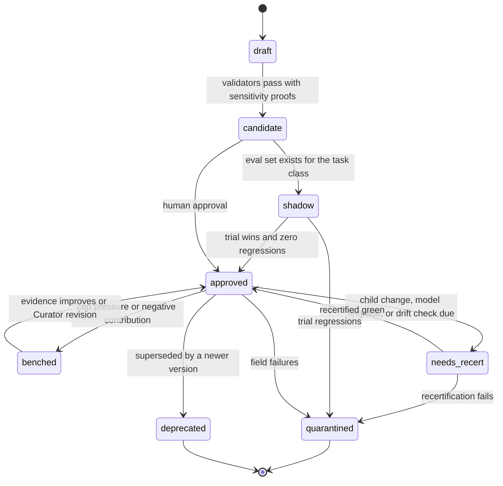

# Fandea Architecture: 7. Promotion, trust, and library capacity

## 7. Promotion, trust, and library capacity

### 7.1 Lifecycle and earned autonomy

Per [ADR-0007](../adr/0007-skill-identity-status-and-stats-split.md), the diagram below is a
diagram of `SkillStatus` transitions — `lifecycle`, `active`, `certification`, `retirement` — not
of the immutable `SkillVersion` document. `SkillVersion` never changes after it is written;
these arrows all mutate the append-only status projection alongside it. `quarantined` is reached
here, from the Recertifier or Curator reading evidence across runs (§8.2, §8.4) — never from a
single run's task-plane graph (§5.1, [ADR-0008](../adr/0008-optional-join-and-failure-signals.md)).

`shadow` is where autonomy is earned: a candidate is retrieved and planned, the approved
version's result is what ships, and the two are compared offline. Enough shadow wins let
policy promote without a human — the human gate relaxes on evidence rather than being absent
from the start.

**Curation provenance affects the bar.** Skills carry `curation`: `human_authored`,
`mined_from_human_artifact`, or `self_distilled`. The one benchmark that separated these found
human-curated skills worth +16.2pp against a no-skill baseline while self-generated skills
delivered +0.0pp ([`references.md`](../references.md) §1.1), so self-distilled skills require more
evidence to reach `approved`. This is a calibration of trust to measured reliability, not a
philosophical position about machine authorship.

Trust is a smoothed success ratio, so one lucky application cannot mint a high-trust skill. But a
ratio is not causal evidence, which is why trust is reported alongside a **causal lift estimate**
from the ablation arm (§11.4). A skill applied to easy tasks will show high trust and zero lift;
only the second number distinguishes a useful skill from a lucky one.

### 7.2 Bounded active set and retirement

The library is capped, and skills are retired on measured contribution. See
[ADR-0006](../adr/0006-bounded-library-and-retirement.md).

| Mechanism | Rule | Default |
| --- | --- | --- |
| **Active cap** | Only `active` skills are retrievable; skills compete for slots per task class | 50 |
| **Contribution** | `ĉ(s) =` mean success with the skill applied, minus the control-arm baseline for that task class; success counted from required non-`judge` criteria only | — |
| **Evidence floor** | No retirement decision before this many applications | 30 |
| **Retirement threshold** | Bench when `ĉ(s) ≤ −τ` and the evidence floor is met | `τ = 0.10` |
| **Low evidence** | Score-demote in ranking; never drop | — |

Three properties this buys, each answering a specific failure:

**A performance floor.** With a finite cap and threshold, expected performance cannot drift more
than a bounded margin below the no-memory baseline. With an unbounded library and no retirement
rule, that bound does not exist at all — which is the configuration the earlier draft had.

**Retirement that measures the right thing.** Contribution is lift over solving *without* the
skill, not a raw success ratio. The control arm (§11.4) supplies the baseline, so the measurement
machinery already in the design does double duty here. And it is scored from required non-`judge`
criteria only: a false-pass-biased model judge does not add noise to retirement, it *switches
retirement off* ([`references.md`](../references.md) §1.8), so a skill whose only required criteria
are model-scored has `contribution = null` rather than a flattering estimate.

**Protection against over-pruning.** Aggressive retirement is not a conservative choice: in the
one ablation that tested it, harsh settings performed *below* the no-skill floor
([`references.md`](../references.md) §1.2). Hence the evidence floor, a deliberately loose threshold,
and reversible benching rather than deletion. An earlier draft of this design cut skills at a 0.4
trust ratio after three applications, which is precisely the harmful setting.

Benching is reversible and lossless: history is retained, and a benched skill returns to `active`
when evidence improves or the Curator revises it. Because a cap means good skills can be benched
by competition rather than by poor performance, `active_cap_pressure` is tracked so a chronically
saturated cap is visible instead of silently discarding value.
