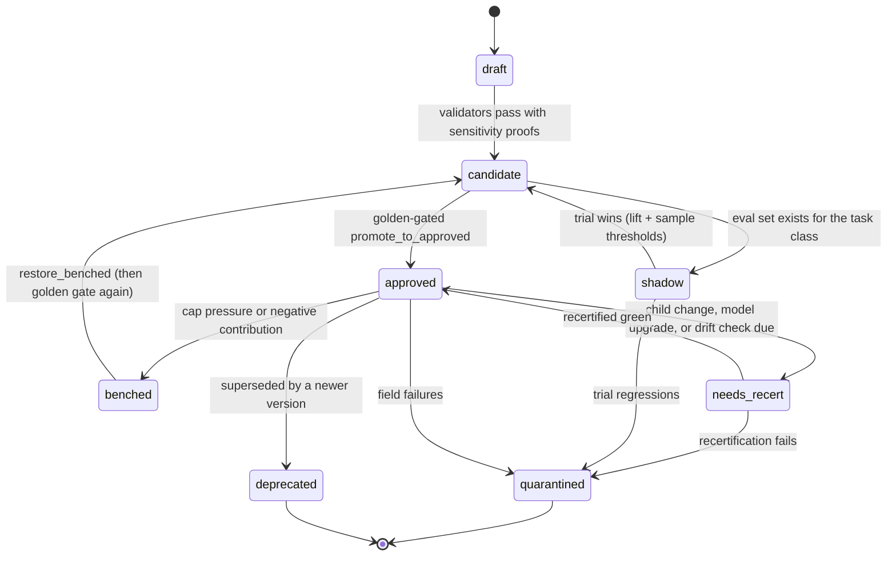

# Recertia Architecture: 7. Promotion, trust, and library capacity

## 7. Promotion, trust, and library capacity

### 7.1 Lifecycle and earned autonomy

Per [ADR-0007](../adr/0007-skill-identity-status-and-stats-split.md), the diagram below is a
diagram of `SkillStatus` transitions — `lifecycle`, `active`, `certification`, `retirement` — not
of the immutable `SkillVersion` document. `SkillVersion` never changes after it is written;
these arrows all mutate the append-only status projection alongside it. `quarantined` is reached
here, from the Recertifier or Curator reading evidence across runs (§8.2, §8.4) — never from a
single run's task-plane graph (§5.1, [ADR-0008](../adr/0008-optional-join-and-failure-signals.md)).

`shadow` is where autonomy is earned: a candidate is retrieved and planned, the approved
version's result is what ships, and the two are compared offline. Enough shadow wins advance
the version back to `candidate` (`maybe_advance_shadow_to_candidate`); golden-gated
`promote_to_approved` remains required before `approved`. The human gate relaxes on evidence
rather than being absent from the start — shadow never writes `approved` directly.

**Golden pass is a license to exist, not a ticket onto the live mix.** Human-authored and
`mined_from_human_artifact` skills go `active` on approval. `self_distilled` skills are
`approved` but stay inactive and use bounded shadow slots until contribution is non-negative.
Below the evidence floor they are not dropped (Ratchet A4); they are also not retrieved for
direct application. `recompute_active_set` will not place an ineligible self-distilled skill
in the active cap.

For `self_distilled` skills, `approved` also requires
`SkillStats.apply_diversity.distinct_apply_sessions ≥ 2` when applications have been observed
(ADR-0015). The gate does not apply at `candidate` or `shadow`. Application sessions are
counted on stats, not on `Provenance`.

Successor promotion is differential: `skill@vN` must pass every golden fixture `vN−1` passed,
in addition to its own suite. A candidate that still "solves" its own fixture but fails a
predecessor fixture is refused.

A transition into `quarantined` enqueues lineage revoke; the Recertifier drains it (§8.4),
including a **field off-ramp**: two consecutive treatment-arm failures where the skill was
applied (eval fixtures and practice/shadow/control excluded). The task plane never marks a
stored version quarantined. The console shows `live_mix.reason` (`live`, `shadow_trial`,
`quarantined`, …) so an operator can see why a certified skill is not steering traffic.

**Curation provenance affects the bar.** Skills carry `curation`: `human_authored`,
`mined_from_human_artifact`, or `self_distilled`. The one benchmark that separated these found
human-curated skills worth +16.2pp against a no-skill baseline while self-generated skills
delivered +0.0pp ([`references.md`](../references.md) §1.1), so self-distilled skills require more
evidence to reach `approved`. This is a calibration of trust to measured reliability, not a
philosophical position about machine authorship.

Trust is a smoothed success ratio (`PredictiveTrust`), so one lucky application cannot mint a
high-trust skill. But a ratio is not causal evidence, which is why trust is reported alongside
a **class-level retrieval ablation** (§11.4) and a **per-skill contribution** from randomized
shadow versus suppression (§7.2). A skill applied to easy tasks will show high trust and zero
per-skill lift; only the separated effect estimates distinguish a useful skill from a lucky one.

### 7.2 Bounded active set and retirement

The library is capped, and skills are retired on measured contribution. See
[ADR-0006](../adr/0006-bounded-library-and-retirement.md).

| Mechanism | Rule | Default |
| --- | --- | --- |
| **Active cap** | Only `active` skills are retrievable for application; skills compete for slots per task class | 50 |
| **Predictive trust** | Observational calibration `(successes+1)/(applications+2)` — not a causal effect | — |
| **Retrieval ablation** | Class-level effect of retrieval available vs suppressed (randomized at the retrieval boundary) | — |
| **Contribution** | `ĉ(s) =` shadow success rate minus this skill's suppressed success rate; success from required non-`judge` criteria only | — |
| **Evidence floor** | No retirement decision before this many shadow applications | 30 |
| **Retirement threshold** | Bench when `ĉ(s) ≤ −τ` and the evidence floor is met | `τ = 0.10` |
| **Shadow / exploration slots** | Bounded offline slots for `benched` and inactive `approved` versions; never expand the active set | 3 / class |
| **Low evidence** | Score-demote in ranking; never drop | — |

Three properties this buys, each answering a specific failure:

**A performance floor.** With a finite cap and threshold, expected performance cannot drift more
than a bounded margin below the no-memory baseline. With an unbounded library and no retirement
rule, that bound does not exist at all — which is the configuration the earlier draft had.

**Retirement that measures the right thing.** Contribution is this skill's lift under
randomized shadow versus suppression, not a raw success ratio and not a class-level control
baseline subtracted from a selected skill. Class-level retrieval help is a separate
`RetrievalAblationEffect`. And contribution is scored from required non-`judge` criteria only: a
false-pass-biased model judge does not add noise to retirement, it *switches retirement off*
([`references.md`](../references.md) §1.8), so a skill whose only required criteria are
model-scored has `contribution = null` rather than a flattering estimate.

**Protection against over-pruning.** Aggressive retirement is not a conservative choice: in the
one ablation that tested it, harsh settings performed *below* the no-skill floor
([`references.md`](../references.md) §1.2). Hence the evidence floor, a deliberately loose threshold,
and reversible benching rather than deletion. An earlier draft of this design cut skills at a 0.4
trust ratio after three applications, which is precisely the harmful setting.

Benching is reversible and lossless: history is retained, and a benched skill returns to `active`
when evidence improves or the Curator revises it. Because a benched version is not in the active
retrieval set, bounded shadow/exploration slots exist so it can still gather restoration
evidence offline. Because a cap means good skills can be benched by competition rather than by
poor performance, `active_cap_pressure` is tracked so a chronically saturated cap is visible
instead of silently discarding value.
