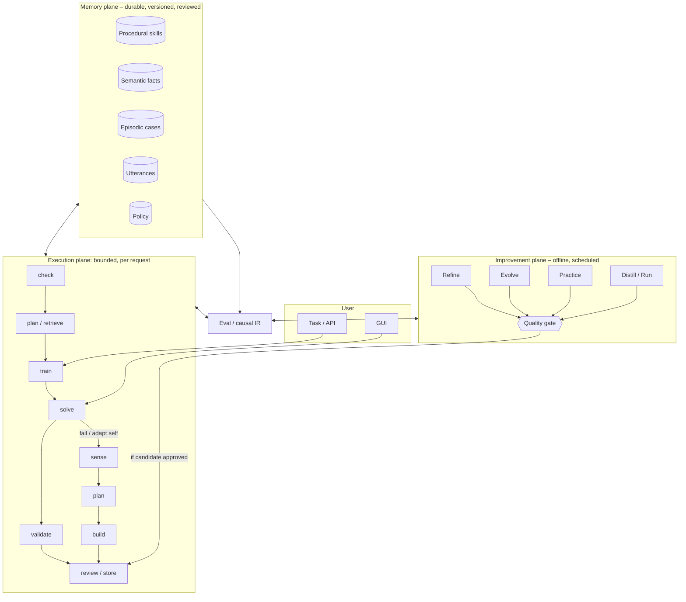

# Recertia Architecture: Overview

## 1. Purpose and scope

Recertia is a task-solving system whose competence increases with use. It does this by
treating *solved work* as durable, versioned, retrievable state, and by making retrieval a
mandatory step before any new problem-solving attempt.

This document describes the runtime shape. Data contracts are in
[the core entities and skill contracts](../specifications/core-entities.md); build order is in
[`archive/2026-Q3/implementation-plan.md`](../archive/2026-Q3/implementation-plan.md). Decisions with alternatives worth
recording live in [`adr/`](../adr/), and [`references.md`](../references.md) lists the literature
this draws on — including the findings that contradicted an earlier draft and changed it.

### Design goals

- A task that resembles a previously solved task should be solved with fewer attempts,
  less model spend, and higher first-attempt success than the first time.
- Nothing enters durable memory that cannot be validated automatically.
- Every stored artifact is attributable to the run that produced it, and revertible.
- The system degrades to "a competent agent with no memory" when memory is empty, and
  never degrades *below* that because of a bad retrieval.
- Improvement claims are falsifiable: the system measures its own lift against a control,
  not against its own optimism.
- The library has a **performance floor**: a bounded active set plus outcome-driven retirement
  keep expected performance from drifting below the no-memory baseline as the library grows
  (§7.2). Growth without this property is a known failure mode, not a theoretical worry — see
  [`references.md`](../references.md) §1.1.

### Explicit non-goals

- No model weight training or fine-tuning. Improvement is representational — memory,
  retrieval, validators, policy — not parametric.
- No unbounded autonomy. Loops are budgeted, promotion is gated, and the system may not
  modify its own safety controls (§14).
- No cross-tenant learning in v1. Memory is scoped to a single owner (§15.4).

## 2. Why a graph with loops

A linear pipeline cannot express the two things this system does most: retrying with new
information, and revising an artifact until it passes a gate. Both are cycles.

A cyclic graph gives each concern exactly one home:

| Concern | Graph construct |
| --- | --- |
| "Have we seen this before?" | A `retrieve` node that always precedes `solve` |
| "Did it actually work?" | A conditional edge out of `validate` |
| "Try again, differently" | A back-edge `evolve → solve` with mutated state |
| "Try several ways at once" | Fan-out to parallel branches, join on validator score (§5.3) |
| "A human must agree" | A `review` node that blocks the write to storage |
| "Don't spin forever" | Budget checks on every back-edge |
| "Get better over time" | Durable stores read by `retrieve` on the *next* walk |

Encoding retries as nested calls inside a solver instead would hide the control flow, make
budgets ad hoc, and make it impossible to checkpoint or audit a partially completed task.
The graph makes iteration explicit, inspectable, and resumable. See
[ADR-0001](../adr/0001-graph-with-loops.md).

## 3. Three planes

The system splits into three planes with different lifetimes. Keeping them separate is
what stops "self-improving" from meaning "one long process you have to trust".

**Execution plane** is one bounded walk per request: check, plan/retrieve, train, solve,
validate, review/store — with a fail/adapt path through sense → plan → build. It never
learns in place; it emits candidate memory writes.

**Memory plane** is the learned state. It is just data — diffable, reviewable, revertible.

**Improvement plane** is the part my first pass under-specified, and it matters: a system
that only learns while a user waits can never reorganise what it knows, practise what it is
bad at, or notice that a skill has rotted. These are scheduled jobs, not a daemon with
opinions (§8).

### Loop levels

- **Inner loop (bounded, in-process):** attempt → check → revise within one run (§10).
- **Outer loop (durable, across runs):** memory written by one run is read by the next.
- **Meta loop (offline, governed):** the improvement plane changes *how* the system learns
   — distiller prompts, retrieval thresholds, routing policy — inside a hard boundary on
   what may change without a human (§14).

## 4. Memory is plural

My first pass had a single store — skills — which meant anything that is not a procedure
had to be rediscovered on every run, and every failure was thrown away. Five stores, each
with a distinct write path and read path. See [ADR-0002](../adr/0002-plural-memory.md).

| Plane | Holds | Written by | Read by | Why it is not a skill |
| --- | --- | --- | --- | --- |
| **Procedural** | Skills: parameterised, validated procedures | `distill` → `review` → `store` | `retrieve` | — |
| **Semantic** | Durable facts and invariants: "migrations run through `scripts/migrate`", "package X is pinned for reason Y" | `distill` (fact extraction), Miner, humans | `retrieve`, `plan`, `solve` | A fact has no steps and no exit code; it constrains *how* a procedure runs |
| **Episodic** | Cases: transcripts of solved and failed attempts, including **dead ends** with the reason they failed | every run, automatically | `retrieve` (analogy), `evolve` (avoid repeats), Practice | Most cases never generalise into a skill; they are still the best evidence for a novel task |
| **Affordance** | Learned model of tools and environment: error signatures, flake rates, latency and cost, version quirks, and observed contention on claimed resources | tool runtime telemetry, `validate` | `plan`, `fan_out`, `solve`, `evolve`, Recertifier | It describes the world, not the work; it changes without any task occurring |
| **Policy** | Meta-parameters: model tier per task class, budget defaults, retrieval thresholds, escalation ladder | Correction miner, eval harness, humans | `intake`, `plan`, `retrieve` | It governs the system's own behaviour and is therefore governed (§14) |

Two consequences worth stating plainly.

**Negative knowledge is first-class.** A failed attempt records *what was tried and why it
failed* into the episodic store, and `evolve` and `retrieve` both read it. The original
design routed failures to quarantine and discarded them, which threw away roughly half of
all available signal — a system that cannot remember dead ends will re-enter them.

**Retrieval is federated.** `retrieve` queries all readable planes and returns a typed
bundle: candidate skills, relevant facts, analogous cases, known dead ends, and tool
cautions. Each element carries its own trust and provenance, and each is subject to the
score floor and precondition filtering in §5.5.
