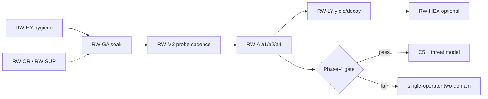

# Remaining work — implementation plan

Companion to the [one-year roadmap](one-year-roadmap.md) (strategy),
[production-readiness](production-readiness.md) (Phase-4 gate), and
[`assumptions.md`](../assumptions.md) (research outcomes). Normative requirements for
the remaining *engineering* surface are in
[`../specifications/remaining-work.md`](../specifications/remaining-work.md).

M0–M9, console **C0–C4**, goal packs **GP0–GP2**, OpenRouter **OR0**, and the
roadmap-remaining CI gates are **shipped**. This document is the build order for what is
not. Sequencing follows the same rule as the archived M0–M9 plan: milestones are ordered
by what each one lets you **measure**, not by calendar appetite. Do not estimate calendar
time.

## 1. Guiding rules

1. **Harness before traffic, traffic before claims.** CI may prove a metric reports
   `"not established"` correctly. Only real `repo-chore` (then `research-synthesis`)
   traffic may move `a1` / `a2` / `a4` off `under evaluation` / `untested`
   ([`assumptions.md`](../assumptions.md) B7).
2. **Ops cadence is a product gate, not a docs footnote.** Operator-mode GA is four
   consecutive soak weeks plus a completed tabletop log. Code that already exists does
   not count as GA.
3. **Do not grow the graph.** Fifteen nodes remain T3. HEX, compress, learned rankers,
   and auto-advance stay off or deferred until their enablement predicates in §8 fire.
4. **Surface completion is parallel, not a substitute for measurement.** CLI/HTTP
   parity and OR polish must not delay probe cadence or soak.
5. **Hygiene is merge-blocking when it lies.** Stale "aspirational" tables and a
   README license line that contradicts `LICENSE` are defects, not style.

## 2. Inventory (what remains)

| ID | Kind | Item | Status |
| --- | --- | --- | --- |
| **RW-GA** | ops | Four consecutive soak weeks; tabletop log; baseline traffic metrics | open (backup/tabletop/canary tooling shipped) |
| **RW-M2** | engineering + ops | Scheduled probe + golden + ablation cadence; fill `MetricReport` holes | engineering shipped; live eval DB is ops |
| **RW-A** | research | Resolve `a1`, `a2`; instrument `a4` on live verifier versions | harness ready |
| **RW-LY** | engineering | `library_yield` and `retrieval_decay` on `MetricReport` | shipped (honest `unavailable` when sparse) |
| **RW-HEX** | gated engineering | Enable `practice_hex_search` / `curator_compress` | gated (JobRunner no-op without predicates) |
| **RW-PC** | engineering | Delete dual active-set path after Phase-2 measurement report | Phase-2 expiry |
| **RW-OR** | engineering | OpenRouter OR1–OR3 polish | OR0–OR2 shipped; OR3 optional |
| **RW-SUR** | engineering | Remaining CLI/HTTP + unified error envelope | shipped (C5 UI still gated) |
| **RW-GP3** | deferred | Goal-pack auto-advance, DAG, `copy_forward` | explicit non-goal |
| **RW-C5** | gated | Multi-tenant console chrome | Phase-4 gate |
| **RW-TM** | ops + docs | Signed threat model; NIST AI RMF if tenant GA proceeds | single-operator §5 deltas accepted-with-owner; tenant signature open |
| **RW-HY** | hygiene | Spec/README drift (license, "aspirational" API table) | shipped |

Deliberately out of scope for this year (unchanged from
[measurement-and-scope.md](measurement-and-scope.md) §18): fine-tuning, learned retrieval
ranker, RL on the policy plane, cross-tenant learning, self-authored tools, a third task
class before Phase 4, engine rewrite, auto-promotion past the golden gate.

## 3. Milestone map

```text
RW-HY  Spec and README drift                                      first (unblocks honesty)
RW-GA  Operator-GA closeout (ops on shipped code)                 Phase 1 remaining
RW-M2  Probe cadence + MetricReport completeness                  Phase 2 remaining
RW-A   Assumption status changes from traffic                     research, never a merge gate
RW-LY  library_yield + retrieval_decay                            Phase 3 remaining CI
RW-PC  Portfolio controller is the only path                      end of Phase 2
RW-OR  OR1 docs/cost gate, OR2 robustness, OR3 presets            parallel with RW-GA
RW-SUR Error envelope + remaining HTTP/CLI                        parallel; not a GA gate
RW-HEX HEX / compress enablement                                  after a1 interval exists
RW-C5  Console C5 + tenant threat model                           Phase-4 gate only
```



## 4. RW-HY — Spec and README drift

**Goal:** living docs match `main`. A reviewer must not be told the console HTTP is
unimplemented, or that the license is MIT.

### Scope

1. [`promotion-api-and-observability.md`](../specifications/promotion-api-and-observability.md)
   §9–10: split **shipped** (including console C0–C4 routes) from **still missing**.
   Today the "Aspirational" table still lists `GET /v1/runs`, SSE, promote, jobs,
   proposals, and `recertia metrics` — all implemented.
2. README Status / License: `LICENSE` is PolyForm Noncommercial; README still says MIT.
3. Index this document from [`architecture.md`](../architecture.md),
   [`specifications.md`](../specifications.md), and the README documents table
   (this PR).

**Done when (engineering):** `python3 scripts/check_cross_refs.py --check` passes;
the promotion-api table does not list a shipped route as unimplemented; README license
line matches `LICENSE`.

**Out of scope:** rewriting archived Q3 plans.

## 5. RW-GA — Operator-GA closeout

**Goal:** one operator can leave Recertia running on `repo-chore` with a real model,
container backend, and truthful spend. Engineering P0-1…P0-5 already landed; this
milestone is the **ops gate** in [one-year-roadmap.md](one-year-roadmap.md) §2.

Shipped (do not rebuild): cost table + `ModelResponse.cost_usd`; command policy +
untrusted fetch delimiters; observe–act scratch loop; `RunManifest` pins;
`docker-compose.soak.yml` + `.github/workflows/weekly-ops.yml`;
[incident-tabletop.md](incident-tabletop.md); `recertia backup` / `recertia restore`;
`recertia tabletop`; `recertia canary` (synthetic + optional `--live`);
`scripts/backup_recertia.py`.

### Remaining work

| Item | Kind | Detail |
| --- | --- | --- |
| Soak log | ops | Four consecutive Monday `weekly-ops` runs (or equivalent self-hosted cadence) with artifacts retained. Empty-eval-DB JSON is **not** a soak week. |
| Live traffic | ops | Operator runs against a real repo with `RECERTIA_EXECUTION_BACKEND=container` and a non-stub model. Record `reuse_rate`, `first_attempt_success`, `attempts_to_success`, `cost_per_solved_task`. |
| Tabletop log | ops | Run `recertia tabletop <run_id> --restore-from <backup.tar.gz>` and keep the JSON (date, run id, restore source, TTR, follow-up). Tooling is shipped; the filled log is ops. |
| Postgres soak | ops | `scripts/soak_postgres.py --recertia-root .recertia` against compose Postgres **with** a snapshot if one exists. CI already migrates an empty DB and reports `recertia_snapshot=absent`. |
| Backup cron | ops | Nightly `python3 scripts/backup_recertia.py` (or volume snapshot); target RPO ≤ 24h. |
| Verifier split | ops | Distinct `RECERTIA_VERIFIER_MODEL_ID` on the soak host; `recertia canary --live` when that env is set. |

**Done when (ops gate, not CI):** four consecutive soak weeks green; tabletop log
exists; baseline metrics exist as numbers-or-unavailable on real traffic; zero open P0
rows from the principal review.

**Research recorded, not gated:** those baseline numbers. No lift claim this milestone.

**GA criteria:** the ops gate above. Code-complete ≠ GA.

## 6. RW-M2 — Probe cadence and MetricReport completeness

**Goal:** the weekly lift report is generated from **scheduled eval traffic**, not from
an empty checkout, and every §11 / §23 metric that is already on `MetricReport` is
either a number or an honest `unavailable` reason.

Shipped: `recertia metrics`, `scripts/weekly_metrics_report.py`, judge canary
fixtures, `recertia probes run`, `recertia canary` / `--live`, weekly-ops golden
suite + synthetic canary, `curation_gap` / `practice_conversion` /
`retirement_reversal_rate` / `active_cap_pressure` / `judge_false_pass_rate` /
`mean_composition_depth` / yield / decay fields.

### Remaining engineering

Engineering is shipped. Remaining is **ops**: weekly report against live
eval rows; `causal_lift` prints `"not established"` whenever the Wilson interval
spans zero; live verifier canary rates attributed to `provider × model_version`
without updating `a4` from CI.

**Done when (engineering):** CI synthetic observations produce `library_yield` and
`retrieval_decay` (or `unavailable`); probe runner fails CI if labelled precision
drops below the M1 floor of 0.7 on the committed probe set; weekly workflow uploads a
report that includes probe precision when an eval DB is present.

**Done when (ops):** the weekly report runs against live eval rows; `causal_lift`
prints `"not established"` whenever the Wilson interval spans zero.

**Research (RW-A, not a merge gate):** `a1` → `supported` or `refuted` with interval;
`a2` with observed certification-trial accumulation; `a4` → `under evaluation` with
the first live canary rates. Negative `a1` **halts** Phase-3 scope expansion
([roadmap](one-year-roadmap.md) §3).

## 7. RW-LY / RW-PC / RW-HEX — Library economics remainder

Shipped: trajectory emit, `ReplayPack` on Curator, `parallelise` / `serialise` /
`correction` jobs, retirement and composition fields on reports.

### RW-LY

Compute and export `library_yield` and `retrieval_decay` (see RW-M2). Dashboard /
`GET /v1/metrics/report` MUST pass `unavailable` through (PC-5 already locks this
pattern).

**Done when:** a Curator proposal in CI includes a replay pack **and** the weekly
report can show yield/decay or an honest hole; no silent zeros.

### RW-PC — Portfolio dual-path expiry

`recompute_active_set` still has a legacy implementation behind
`RECERTIA_PORTFOLIO_CONTROLLER`. That flag is T3-adjacent scaffolding, not operator
config ([`active_set.py`](../../src/recertia/memory/procedural/active_set.py)).

**Done when:** `docs/architecture/portfolio-measurement.md` exists (Phase-2
measurement report); `_recompute_active_set_legacy` and the env flag are deleted;
`tests/unit/memory/test_portfolio_equivalence.py` expiry guard is green because both
are gone.

Do **not** delete the dual path before the measurement report: the equivalence tests
are the proof the pure controller may become the only path.

### RW-HEX — Enablement (blocked)

`policy/default.json` keeps `practice_hex_search` and `curator_compress` **false**.
Enablement predicate (all required):

1. `practice_conversion` is a number (not `unavailable`) on a weekly report.
2. `causal_lift` for `repo-chore` has a Wilson interval that **excludes** zero, or
   `a1` is `refuted` and a design review explicitly re-opens HEX as a recovery
   experiment (still T2, still golden-gated).
3. `JobQuota` leftover admits HEX at `hex_share` without starving recertifier /
   curator retire.

Until then, jobs MUST refuse HEX/compress even if an operator flips the JSON locally
in production without an eval-compare note in the ledger.

## 8. RW-OR — OpenRouter polish (OR1–OR3)

OR0 is shipped. Remaining from
[`archive/2026-Q3/implementation-plan-openai-compat.md`](../archive/2026-Q3/implementation-plan-openai-compat.md):

| Milestone | Work | Done when |
| --- | --- | --- |
| **OR1** | Docs gate: configuring a gateway MUST NOT be cited as evidence for `a1`. Price-override env already in go-live — add a CI check or test that `estimate_cost_usd` for an unknown slug uses defaults and `unavailable`/notes do not say "vendor-exact". | OG-7 (see spec) |
| **OR2** | Default `max_tokens` via `RECERTIA_OPENAI_MAX_TOKENS` or EXTRA_BODY; map OpenRouter error JSON to `ProviderError`; tolerate list-shaped `message.content` text parts | OG-8…OG-10 |
| **OR3** | Server-side allowlist of `provider:slug` for Pilot; unknown slug → 400; SPA never stores keys | optional; PC-7 |

OR3 is optional for single-operator GA (env-level model is enough).

## 9. RW-SUR — Remaining HTTP and CLI

Console C0–C4 already expose runs list, SSE, cancel, skills, promote, proposals,
jobs, metrics, ledger, programs. The promotion-api "aspirational" list is therefore
mostly **docs drift** (RW-HY) plus a smaller true remainder:

| Surface | Status | Remaining |
| --- | --- | --- |
| `GET/POST /v1/reviews` | missing | Distill-review queue distinct from job `proposals` |
| `POST /v1/evals/runs` | missing | Golden set against a library snapshot (CLI `recertia lift` exists) |
| `GET /v1/facts` · `/v1/cases` · `/v1/affordances` | missing | Read non-procedural planes |
| `POST /v1/memory/query` | missing | Federated retrieve debug (CLI `skills search --explain` is procedural-only) |
| `GET /v1/policy` · `POST /v1/policy/proposals` | missing | T2 change proposals; human approval + ledger |
| Unified error envelope | missing | `{error:{code,message,run_id,retryable}}` — handlers still use FastAPI `detail` |
| CLI `skills list/show`, `review`, `eval run`, `memory query`, `facts`, `cases`, `proposals`, `policy` | missing | Console twins; not a C0–C4 gate |

**Priority:** error envelope and `POST /v1/evals/runs` (measurement). Policy HTTP
before C5. Facts/cases/affordances after RW-M2. Review HTTP can alias proposals
until distill-review volume justifies a split.

**Done when:** envelope tests on `POST /v1/runs` budget exhaustion; eval-run
endpoint writes the same `EvalObservation` rows as `recertia lift`; no new route
skips tenant isolation (PC-1).

## 10. RW-C5 / RW-TM — Phase 4 remainder

Do not start C5 UI until [production-readiness.md](production-readiness.md) go/defer
criteria hold. Remaining:

1. Threat-model re-review of principal-review §5 deltas — **accepted-with-owner** for
   single-operator ([threat-model-deltas.md](threat-model-deltas.md)); second-party
   signature still required before tenant GA.
2. NIST AI RMF Govern/Map — **open**, tenant-only.
3. Console C5: `GET /v1/me` multi-tenant switcher; cross-tenant leakage tests
   (planted-secret e2e already exists).
4. `research-synthesis` on **unchanged** runtime against real briefs (fixture is
   shipped; traffic is not).
5. Model-provider failover (P2-5): **deliberate-absence candidate** — decide at the
   gate with canary cost, do not build now.

Acceptable year-end: two-domain single-operator product.

## 11. Explicitly deferred (not remaining work)

| Item | Why |
| --- | --- |
| Goal-pack auto-advance, DAG, `copy_forward` | ADR-0014; `git_tip` is the continuity path |
| UNC / `\\?\` registered workspace roots | Windows v1 is drive-letter roots only |
| Provider token streaming into Pilot | SSE is run events, not tokens |
| Marking `a1`/`a2`/`a4` `supported` from CI | B7 |
| HEX/compress on by default | Enablement predicate in §7 |
| Third task class | Phase 4+ |
| Multi-tenant GA | Gate in production-readiness.md |

## 12. Operating cadence (unchanged)

Weekly metrics review, monthly assumptions register, quarterly threat-model refresh —
[roadmap §6](one-year-roadmap.md). Status changes to `a1`–`a4` are **commits** to
[`assumptions.md`](../assumptions.md), not chat.

## 13. Success criteria for remaining work

1. Operator-mode GA (RW-GA) — unattended `repo-chore` with cost and soak.
2. `a1` and `a2` resolved with intervals, either direction (RW-A).
3. `a4` is a watched number per verifier model version.
4. `library_yield` / `retrieval_decay` are computed, not just defined (RW-LY).
5. Phase-4 go/defer recorded in production-readiness.md with a named owner.
