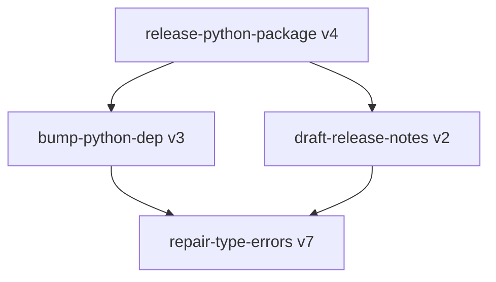

# Fandea Architecture: 6. Skill algebra: composition and hierarchy

## 6. Skill algebra: composition and hierarchy

### 6.1 Steps are a graph, not a list

A skill's steps declare `depends_on`, so the steps of one skill form a DAG rather than a
sequence. Independent steps run concurrently; only real dependencies serialise.

This exists because an ordered list encodes a dependency between every adjacent pair, most of
which do not exist. "Review file A, then review file B" reads as a sequence but the second step
never consumes the first's output, so the ordering buys nothing and costs the sum of both
runtimes instead of the larger one. The **fake-edge test** — does this step actually consume what
the previous one produced? — is the rule for authoring and for Curator review alike
([`references.md`](../references.md) §1.7).

Constraints: the step graph is acyclic and validated at store time; `depends_on` ids must exist;
concurrency additionally respects resource claims (§5.6), so two steps with overlapping write
claims serialise even when neither depends on the other's output; and a merge step reading many
predecessors follows the merge discipline in §5.10.

The authoring prior (§5.8) instructs the distiller to declare only edges that carry data, which
makes parallelism the default outcome of honest authoring rather than a later optimisation.

### 6.2 Skills compose

Flat skills scale badly. Coverage grows combinatorially with task variation while a flat
library grows linearly with tasks solved, so a flat design forces either an enormous library
or narrow coverage. Skills therefore compose: a skill may declare `uses: [{skill_id,
version}]` and invoke a pinned child version as a step.

Rules that make composition safe rather than a new failure mode:

- **Pinned children.** A parent references an exact child version, so a child's evolution
  cannot silently change a parent's behaviour.
- **Acyclic.** The `uses` graph is a DAG; cycles are rejected at store time.
- **Transitive invalidation.** Quarantining or deprecating a child marks every parent that
  pins it as `needs_recert`. Parents re-validate against their golden set before returning to
  `approved`.
- **Depth bound.** Composition depth ≤ 3 in v1, since deeper chains make attribution and
  budget accounting unreliable.
- **Abstraction is the Curator's job.** When several skills share a step sequence, the
  Curator proposes extracting a child skill and rewriting the parents as a reviewable change
  (§8.2). Abstraction is how the library gets *smaller* while coverage grows — the only
  mechanism here that fights entropy.
