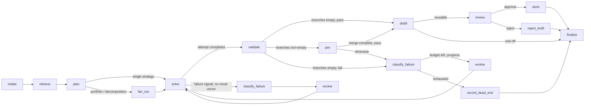
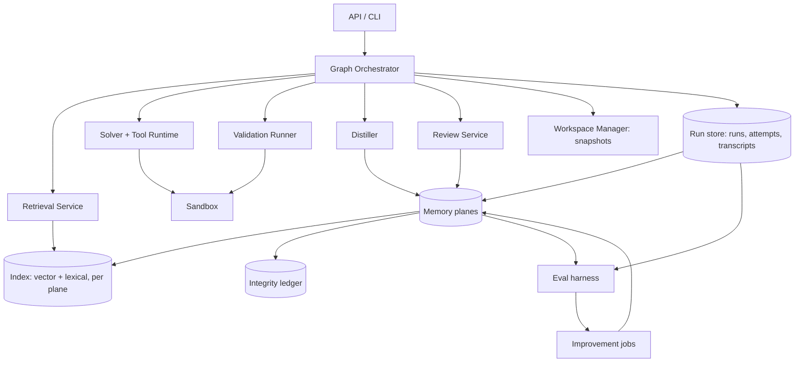

# Recertia Architecture: 5. Task plane

## 5. Task plane

### 5.1 Node topology

Fifteen nodes. Per [ADR-0008](../adr/0008-optional-join-and-failure-signals.md), `join` exists only
on the fan-out path — the default, single-attempt path (everything through M5, per
`archive/2026-Q3/implementation-plan.md`) routes `validate` straight to `distill` or `classify_failure`, matching
the simplified loop in [`README.md`](../../README.md). The overloaded `quarantine` node is split
into `record_dead_end` (a run failed) and `reject_draft` (a draft was rejected); marking a
*stored skill version* harmful is a `SkillStatus` write made by the Recertifier or Curator
(§7.1, §8.4), not a task-plane route at all.

| Node | Responsibility | Must not do |
| --- | --- | --- |
| `intake` | Normalise the request into a `Task`; resolve budgets and model tier from the policy store; record the run manifest (§11.3); **lock pre-registered `TaskCriterion`s** (§11.1) | Call a solver model, or accept a skill as a criteria source |
| `retrieve` | Federated query across memory planes; evaluate preconditions; apply score floor; honour ablation suppression (§11.4) | Execute anything |
| `plan` | Choose `apply` / `adapt` / `scratch` / `portfolio` / `decomposition` / `abstain`; emit a calibrated `predicted_success`; record the reason; MAY emit a deterministic `ExecutionGuide` (default off) | Mutate memory, add to the run's locked criteria, or call a happy-path LLM to stitch skills |
| `fan_out` | Split budget across ≤3 branches — racing strategies, or disjoint parts of the work — with disjoint workspaces and non-overlapping write claims | Exceed the parent budget, or fan out work whose criteria cannot be partitioned |
| `solve` | Execute the skill's step graph in dependency waves with bounded concurrency, producing artifacts plus a structured transcript, inside an isolated attempt workspace (§10.2); MAY raise a failure signal directly, before any result exists | Judge its own success, or run steps whose resource claims collide |
| `validate` | Execute locked criteria in a sandbox; score model-judged criteria in fresh contexts; score the applied skill's certification criteria as an advisory observation; emit a per-criterion result vector | Rewrite or relax criteria, let a certification observation gate the route, or show a judge the solver's reasoning |
| `join` | *Only reached when `fan_out` ran.* Audit expected against received inputs; select a portfolio winner by validator result then cost, or reduce and synthesise decomposition inputs; discard losers to episodic memory | Prefer a branch on model preference alone, or synthesise across a gap |
| `classify_failure` | Assign a failure class from the taxonomy (§12) with evidence, given a raised failure signal | Retry, or require a result vector that may not exist |
| `evolve` | Choose the repair move dictated by the failure class; MAY apply one Practice-published `PatchTemplate` (O(1) lookup); decrement a budget; restore the workspace to a clean snapshot | Search, hold a patch tree, or loop without a class or a budget decrement |
| `distill` | Extract skill draft **and** facts and affordance updates; apply the reusability filter | Store directly, or scan episodic memory for failure clusters |
| `review` | Apply promotion policy; request a human when policy requires | Block the caller's answer, or mark an existing stored version quarantined |
| `store` | Idempotent, transactional write of new versions with lineage; stamp lint hash; append to the integrity ledger | Overwrite an existing version |
| `record_dead_end` | Record the failed run and its dead end to episodic memory; upsert the incremental failure-cluster row | Touch a stored skill version's lifecycle, or enqueue lineage revoke |
| `reject_draft` | Record the rejection and the reviewer's diff for the Correction Miner; write no version | Quarantine an already-approved version |

`finalize` returns the caller's answer. It does not wait on review: a run can succeed while
its distilled skill sits pending.

`abstain` deserves emphasis as a legitimate plan outcome. A system that always acts cannot
improve its judgment about when not to; abstention with a stated reason is recorded, scored
for calibration, and is often the correct behaviour on a novel destructive task.

### 5.2 Component architecture

### 5.3 Graph Orchestrator

Owns state transitions, routing, budget accounting, checkpointing, and now fan-out/join.
Checkpoints after every node, so runs are resumable at node granularity. Deterministic given
`(state, node outputs)`, which is what makes replay testing possible.

**Fan-out exists because validators make parallel exploration cheap to adjudicate.** When
several plausible strategies exist — apply skill A, adapt skill B, solve from scratch —
running them concurrently and letting the criteria pick the winner converts model
uncertainty into compute spend, which is the trade you want when a validator is trustworthy.
It also gives shadow trials (§7) and ablation arms (§11.4) the same machinery.

Two kinds of fan-out, with different join semantics:

| Kind | Branches are | Join rule | Use when |
| --- | --- | --- | --- |
| **Portfolio** | Competing strategies for the *same* task | One winner by criteria, then cost | The right approach is uncertain |
| **Decomposition** | Disjoint *parts* of the work | All must complete, then synthesise | The work is wide and parts are independent |

Decomposition is the "diamond" — fan out, reduce, synthesise — and it was missing from the
first draft, which could only race strategies against each other, never split work
([`references.md`](../references.md) §1.7). The test for whether a split is legitimate is the
same as for skill steps: a dependency is real only if the later unit consumes what the earlier
one produced. Store-time `input_bindings` make that structural for skill DAGs; steps ordered
merely because someone wrote them in that order are sequential for no reason, and that ordering
is usually where latency hides (§6.1).

Constraints on both kinds: branches get disjoint workspaces **and** non-overlapping write
claims on shared resources (§5.6), the parent budget is divided rather than multiplied, `join`
breaks ties by cost rather than model preference, and every join audits input completeness
(§5.10).

### 5.4 Memory stores

Canonical representation per plane:

- **Procedural:** the immutable `SkillVersion` document at `skills/<slug>/v<N>/version.json`, in
  git — promotion is a pull request, rollback is a revert. `SkillStatus` (lifecycle, active,
  certification, retirement) and `SkillStats` (trust, contribution) are separate, non-git
  runtime records keyed to the same `(skill_id, version)` (ADR-0007); they change on every
  promotion or application without touching the reviewed document.
- **Semantic:** `facts/<scope>/<slug>.json`, in git, each with provenance and an optional
  verification check.
- **Episodic:** content-addressed transcript blobs plus a case index row. Not in git — high
  volume, write-once.
- **Affordance:** derived telemetry aggregates, rebuildable from the run store.
- **Policy:** a versioned config document in git, changeable only under §14 rules.

Everything queryable is rebuildable from the canonical form. That rule is what lets the
index be treated as a cache rather than as a second source of truth.

### 5.5 Retrieval Service

Hybrid by necessity: lexical matching catches exact tool and entity names, vector similarity
catches paraphrase. Merge with reciprocal rank fusion, filter by declared preconditions,
rerank, then apply a score floor. Returns a typed bundle across planes (§4).

Retrieval remains the highest-leverage failure surface — a confidently wrong skill is worse
than empty memory because it anchors the solver. Controls: preconditions **drop** candidates
rather than down-ranking them, a score floor discards weak matches, `plan` may reject
everything, and an empty bundle is a healthy outcome. Retrieval is reproducible because the
index snapshot id is recorded in the run manifest.

Only the **active set** is retrievable (§7.2). This matters more than it sounds: flat retrieval
is reported to degrade in the moderate regime of tens to hundreds of skills
([`references.md`](../references.md) §1.5), so an unbounded retrievable library is a decay mechanism
rather than a growing asset. Skills below the evidence floor are score-demoted rather than
dropped, since premature exclusion measured *worse* than having no library at all
([`references.md`](../references.md) §1.2).

### 5.6 Solver and Tool Runtime

Model-driven execution against a registered tool set. Every call and result is appended to a
structured transcript — the transcript is the raw material for distillation, so it is a
product, not a log. Tools declare a side-effect class (`read`, `write`, `external`) and
required approvals; anything beyond `read` runs sandboxed and, when policy demands, waits for
approval. Tool telemetry (durations, exit signatures, retries) feeds the affordance plane.

**Resource claims make hidden edges visible.** Two steps can look independent because neither
mentions the other while both write the same file, hold the same lock, or exhaust the same
rate-limited API. Workspace isolation does not help, because the collision is outside the
workspace. Steps and tools therefore declare claims — `file`, `path`, `service`, `rate_limit`,
`lock`, `external_system` — in `read`, `write`, or `exclusive` mode, and overlapping non-read
claims are treated as a dependency edge that forbids concurrency
([`references.md`](../references.md) §1.7).

### 5.7 Validation Runner

Executes locked `certification_criteria`/`TaskCriterion`s as real, isolated checks with per-criterion pass/fail and
captured output. Kinds: `command`, `assertion`, `schema`, `metric`, `judge`. A `judge`
criterion is never sufficient alone — promotion requires at least one non-`judge` criterion —
and every criterion must carry a **sensitivity proof** (§11.2).

**Model-scored criteria run in a fresh context.** A judge that inherits the solver's transcript
is not checking the work, it is agreeing with the reasoning that produced it — the same
self-agreement failure that makes a model a poor grader of its own output, just wearing a second
name. Judges therefore receive the artifact and the rubric and nothing else.

**Judges triangulate rather than repeat.** When several model-scored criteria apply, they must
ask different questions — `correctness`, `currency`, `provenance`, `scope`, `safety` — because
a few different lenses catch what many identical ones miss
([`references.md`](../references.md) §1.7).

### 5.8 Distiller

Two authoring paths, because skills learned from success and skills learned from failure carry
different information:

- **Success path.** A winning transcript becomes a skill draft, extracted facts, and affordance
  updates. Literals generalise into parameters, incidental steps are pruned, criteria are
  proposed. Dependencies and resource claims are derived from what the transcript shows —
  an edge only where a later step read an earlier step's output, a claim wherever a tool call
  touched something shared — rather than from the order the steps happened to run in. A
  transcript is inherently sequential, so writing edges from that order is the default failure
  and it silently serialises every skill the system learns.
- **Failure-cluster path.** Recurring failures in the episodic plane — the same dead end reached
  by three or more runs in a task class — become pitfall-oriented skills whose substance is
  `failure_modes` and preconditions rather than a happy-path sequence. This path exists because
  the systems that measured real gains synthesise from failure clusters, and because constraining
  guardrails outperformed aspirational guidance ([`references.md`](../references.md) §1.4).

Both paths run under an **authoring prior**: versioned guidance fixing skill shape, granularity,
and naming. This is a T2 surface (§14) and the single highest-value component in the one ablation
study that measured its removal, costing 43% of the total gain
([`references.md`](../references.md) §1.3). It also implicitly
suppresses near-duplicates, which is why deduplication is a secondary Curator mechanism here
rather than a primary one.

The **reusability filter** keeps the library from filling with one-offs. All checks must pass:
parameterisable, context-free, checkable, not a near-duplicate, and bounded. A `one_off` verdict
is recorded against the task class rather than discarded; three accumulated one-offs in a class is
the strongest available signal that a skill is missing, and the Practice job (§8.3) consumes
exactly that signal.

### 5.9 Review Service

Implements the promotion lifecycle and the human gate (§7), plus trust and calibration
bookkeeping.

### 5.10 Merge discipline

Fan-in is where graphs fail differently from chains, and worse. In a chain a dead step halts
everything, which is annoying but obvious. In a graph, one dead branch among many can vanish into
a synthesis that looks complete ([`references.md`](../references.md) §1.7). Two rules:

**Count inputs at every merge.** Each fan-in records expected against received and either flags
or fails on a gap. Proceeding silently on partial data is forbidden, because the output is
indistinguishable from a full result.

**Layer the fan-in.** Feeding many raw branch outputs into one synthesis step exhausts context
before synthesis begins. Merges batch, summarise each batch, then combine summaries — never the
raw pile. Reduction steps prefer plain code over a model wherever the combination is mechanical,
since deterministic reduction is cheaper and cannot hallucinate a merge.
