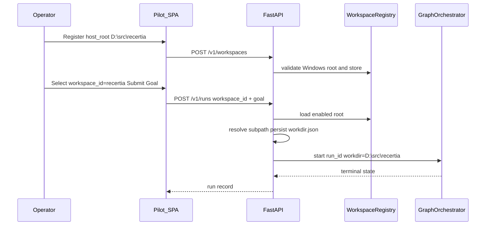

# Registered workspaces — implementation plan

Build order for Pilot workdir binding via allowlisted Windows host roots.
Normative contracts: [`specifications/registered-workspaces.md`](specifications/registered-workspaces.md).
Architecture note: [`architecture/product-console.md`](architecture/product-console.md) §3.1 Workdir picker.

## Guiding rules

1. **No raw absolute `workdir` on create-run.** Registry is the only API path to host trees.
2. **Preserve sandbox default.** Omitting `workspace_id` keeps today’s
   `workspaces/<tenant>/<run_id>/` behaviour and existing tests.
3. **Windows drive-letter roots first.** Reject UNC / extended-length until a later revision.
4. **Admin registers; runners bind.** `runs` may use enabled workspaces; `admin` (or console
   `admin`) creates/disables them.
5. **Resume is strict.** Disabled, missing, or drifted `host_root` → hard fail (409), never
   silent sandbox fallback.

## Milestones

```text
RW0  Registry + create/resume resolution + tests
RW1  Pilot UI (select + subpath) + register form + Programs wire-up
RW2  Docs/go-live polish + optional CLI --workspace-id sugar
```

| Milestone | Status | Notes |
| --- | --- | --- |
| RW0 | Implemented | Backend contracts, store, API, workdir.json kind |
| RW1 | Implemented | `/console` Pilot + Auth/Ops registration |
| RW2 | Implemented | go-live.md, README index, CLI `workspaces` + `run --workspace-id` |

Depends on: existing console C0–C3 (API keys, `/v1/runs`, Pilot SPA, console auth).

---

## RW0 — Registry and run binding

### Scope

- Contract `RegisteredWorkspace` in `contracts/workspace.py`; regenerate schemas.
- Store: `src/recertia/workspaces/registry.py` (SQLite under api root), mirroring
  `programs/store.py` patterns.
- Path helpers: extend [`src/recertia/paths.py`](../src/recertia/paths.py) with
  `normalize_windows_host_root()` / `split_rel_subpath()` (split on `/` and `\`).
- Resolve path in [`src/recertia/api/__init__.py`](../src/recertia/api/__init__.py):
  - Extend `RunCreate` with `workspace_id: str | None`.
  - Branch `_resolve_create_workdir` (or replace with `_resolve_run_workdir`) per spec §5.2.
  - Persist/load `workdir.json` with `kind`.
  - Resume enforcement per §5.3.
- Routes in [`src/recertia/api/console_routes.py`](../src/recertia/api/console_routes.py)
  (or small `workspace_routes.py` registered from `create_app`): CRUD from §5.1.
- Wire Programs step `/run` envelope to pass `workspace_id` through `run_create`.

### Acceptance

- RW-1…RW-6, RW-8, RW-9 green in `tests/unit/test_registered_workspaces.py` (+ extend
  `test_api_runs.py` so absolute-without-id still fails).
- `pytest -v` full suite green; no Docker required.

### Out of scope

- Console HTML/JS (RW1).
- UNC paths.

---

## RW1 — Pilot and registration UI

### Scope

- [`console/static/index.html`](../console/static/index.html): Workspace `<select>` + Subpath
  input on Pilot Run; registration form on Auth/Ops.
- [`console/static/app.js`](../console/static/app.js):
  - Load workspaces on view enter / after register.
  - `submitRun` body includes `workspace_id` / `workdir` per spec §6.2.
  - Client refuse absolute subpaths.
  - Programs step inputs: workspace select + subpath (replace opaque relative-only default
    where binding a host repo is intended).
- Surface resolved workdir in run detail JSON if already returned; otherwise show
  `workspace_id` from create response (add field on `RunRecord` if missing).

### Acceptance

- Manual: register `D:\…\quantrobs\recertia`, Pilot select it, submit
  `evals/golden/repo-chore/add-editorconfig/goal.json` equivalent form → `.editorconfig`
  appears in that checkout.
- RW-7 covered (payload builder unit or lightweight DOM-free extract of body builder).

---

## RW2 — Operator docs and CLI sugar

### Scope

- Update [`docs/architecture/go-live.md`](architecture/go-live.md) Console section with
  register → Pilot steps (Windows examples).
- Link from README documents table.
- Optional: `recertia workspaces register|list` and `recertia run --workspace-id`.

### Acceptance

- go-live instructions match implemented flags/routes.
- CLI sugar is optional; if skipped, document API/`recertia` keys + curl register only.

---

## Suggested code touch list

| Area | Files |
| --- | --- |
| Contract / schema | `contracts/workspace.py`, `scripts/generate_schemas.py` → `schema/` |
| Registry | `src/recertia/workspaces/__init__.py`, `registry.py` |
| Paths | `src/recertia/paths.py` |
| API | `src/recertia/api/__init__.py`, `console_routes.py` |
| Programs | `console_routes.py` program run envelope; `materialize.py` prereq if needed |
| UI | `console/static/index.html`, `app.js` |
| Tests | `tests/unit/test_registered_workspaces.py`, extend `test_api_runs.py`, `test_product_console.py`, `test_migration_programs.py` |
| Specs | this plan; `specifications/registered-workspaces.md`; product-console §2.3 pointer |

## Dependency / risk notes

| Risk | Mitigation |
| --- | --- |
| API under WSL cannot see `D:\…` | Spec requires API host that resolves Windows paths; document “run uvicorn on Windows” for this feature |
| Container backend bind-mount of host repo | Existing Docker Desktop file sharing; document grant for drive |
| Operators edit main branch in place | UX warning; recommend feature branch in go-live |
| Phase-4 multi-tenant | Feature flagged or admin-only; revisit in production-readiness |

## Sequence (integration)


